Learn OpenStack in 4 Hours
_____________________________

DAY-1: Your First Dive into OpenStack
--------------------------------------------------

You will create your first ever instance in OpenStack on this first day
of your fast track course. If you have no hardware to install OpenStack,
don’t worry because we have a solution for that!!. We will come on it
later so let’s be patient and start to know more about OpenStack.

OpenStack is an open source cloud computing framework which enables
organizations to build their own private clouds while providing them the
freedom to customize and use the code according to their needs.

We will not bore you with history of OpenStack but one thing is more
important to share with you. OpenStack is really powerful and many
technology giants are using it for building their cloud infrastructure.

OK, let’s get prepared to spin up our own virtual machine in an
OpenStack environment!!

After this course you will know the most important features provided by
OpenStack, what kind of cloud features can it provide, how it can be
used and above all, you will see that how easy it is to be used!

You will feel yourself that OpenStack is really a power full framework.
This is not all about OpenStack!!!. OpenStack can also be used for:

-  Creating and managing virtual machine instances using different operating systems (Linux, Windows.. )

-  Creating and managing virtual storage space and disks

-  Building high available servers.

-  Creating and managing virtual LANS.

-  And many more…

Well for sure, it is not possible to cover everything about OpenStack in
just 4 hours…we will not over burden you with very lengthy discussions
but we will equip you with all the necessary information and tools
necessary to get you going in the fast lane.

So let’s get ready to dive into OpenStack!!!

For this tutorial we are using:

-  A readily available OpenStack Environment from TryStack

-  No other dependencies …….!

SUMMARY OF DAY-1
-----------------------------

Here are the learning objectives for today’s course:

-  Login to OpenStack Dashboard Online

-  Create a new network segment

-  Create a new virtual machine instance using Ubuntu image in OpenStack

-  Create a router for your network segment

-  Assign a floating IP to access the newly created VM over the Internet

-  Setup security policies to secure the access

-  Remotely access the newly created VM instance over the Internet

-  Play around with different commands available in the VM

It’s time to get started now!

1. Login To OpenStack Dashboard Online

Remember we had told you that we have a solution to access an OpenStack
environment online? 
TryStack provides an online OpenStack environment for learners, developers and researchers. You can create a VM instance of your own in this environment which will be available for 24 hours. 
Since many people want to access this online platform hence resources provided with a set limit. It is prefered that you free your resources including VM instances after your learning session. 
To manage the resources, any VM instance that is up for more than 24 hours will automatically be removed by trystack. 
Below is the link to access TryStack online :

http://trystack.openstack.org/

Before you can use trystack, you need to join the TryStack Facebook Group. Registration is pretty simple!! Just click on the button as displayed
in the below screenshot:

|image1|

One of the trystack admins will approve your access in a short time. Once your login has been approved, you can access the dashboard as below:

|image2|

After you have successfully logged in, you are now free to use OpenStack dashboard!. The OpenStack dashboard is commonly known as 'horizon'. 
In the top right corner, you will see your username. Additionally you can see settings option and an option to sign out.

Horizon is a component of OpenStack which is developed in python and provides a GUI (graphical user interface) which makes OpenStack administration a lot more easier!

All the administrative actions including provisioning can be handled using the dashboard.

On the left side there is another menu with several tabs expanding vertically. The project tab shows those projects which you are a member of.

The overview page of horizon dashboard shows a summary and overview of the OpenStack cloud resources and displays something similar to below image:

|image3|

In this image the 'Overivew' page displays a summary of information including  number of instances created by you, number of vCPUs used out of available vCPUs, number of disk volumes used and so on..

The 'Instances' tab shows the list of instances created by you for this project. You can create, start, stop or terminate an instance using this tab.

The 'Volumes' tab shows the list of disk volumes created by you for this project. You can create , attach, detach or delete a volume using this tab.

Using the 'Access and Security' tab, you can create, list, add delete security groups, add/edit/delete rules for security groups.

The 'Keypairs' tab is one of the most important tabs which is used to create secure keys. You need these keys to access your instance remotely on SSH from your PC. If you loose your keys or forget to download and save the keys to your PC, you can face issues with accessing the VM instance.

Using 'Floating IPs' tab you can associate a floating IP address ( which is a public IP address) to your VM instance.  This IP is usually accessible over the Internet which makes it possible for you to access your VM instance remotely.
The SSH port (  22 by default) must be allowed under 'Access and Security' tab. You can do this by adding a new rule so that SSH traffic for your VM instance can pass through. This rule is not already present in the default security group.

Using 'API Access' tab OpenStack API endpoints can be created.

2. Creating A Network Segment

Any virtual machine instance that you create in the OpenStack environment, needs to be part of at least one network segment. A network segment resembles a VLAN in the real world networking field.
Therefore before jumping into creating a new VM instance, you will create a network segment which you will be able to associate your VM instance with.
Your VM instance will be part of this network like a VLAN. Remember that this is a private network and is not accessible to users other than you. 
This means that all your VM instances will be part of this network and will be isolated from networks created by other users. 
You can infact create more than one private network depending upon your requirements.

Let's explain the important terms used to define a network segment:

	--	Network :  It is the name of the network segment that you want to create. For example you can call it 'Internal' if it is an internal network. 

	--	Subnet   :  It is a block of IP addresses ( IPv4  or IPv6) which will be used to assign IP addresses to the connecting instances.

	--	Port        :  A port is the interface of a VM instance or a virtual router which will be used to connect to this network. It is just like the NIC on a PC.

Now let's proceed towards actually creating a new network. You need to take following steps in order to create a new network:

	a. Under Network on the left menu bar, go to Networks and select create Network as it is depicted in the image below:

|image4|

	b. Now you need to provide a meaningful name to your network. Under the Network tab, fill in the Network Name. Make sure that the 'Admin State' is up. Click Next.

|image5|

As explained earlier, each network must have at least one subnet associated to it. A subnet is a block of IP addresses which will be assigned to the instances which are part of this network.

Next, you need to mention the subnet information.

	c. Under Subnet tab, enter the subnet address in CIDR (Classless Inter Domain Routing) notation.
	    The private IP addresses will be assigned to our VM instances from this subnet. In this example will use 192.168.1.0/24 . 
	     As this is an IPv4 address therefore we will set IP version as IPv4 and click Next

A gateway IP is required so that all the instances on this network with use this IP to send for sending traffic that is destined towards outside world. In other words you can say this gateway IP is the IP address assigned on the router.
|image6|

Next, you need to add some more detailed information about the subnet.
	d. Under Subnet Details tab, make sure that the 'Enable DHCP' option is on. 

		4.1	Under 'Allocation Pools', mention the starting IP address and the ending IP address separated by a comma.  Instances will be assigned IP addresses within this range.

		4.2	Set the DNS name server addresses as 8.8.4.4 and 8.8.8.8 on two separate lines respectively and click Create.

		4.3	Leave the 'Host routes' option as empty.

		4.4	These DNS addresses belong to google and can be used as public DNS addresses. The steps are also shown in this image:

|image7|

3.  Creating A New VM Instance Using Ubuntu Image. 

So you have made great progress so far! You created a network with a private/internal subnet. This has made you able to proceed towards adding a new virtual machine instance.
But before we act to create the instance, here is some valuable information that you need to know:

You can create an instance either from a pre-created machine image, a disk volume or  a snapshot that you may taken have from another disk volume.
OpenStack provides several pre-built images for several operating systems including Windows and Linux.
In case of Linux, you can also choose your favorite flavor. This could be CentOS, Ubuntu, SuSe or any other. 

You can also select the size of an instance that you want to create. It includes number of vCPUs, RAM and disk space.

Now is the action time! Let’s go to Compute menu on the menu on the left and then select 'Launch Instances'.

|image8|

	a. A popup window will appear. Under the details section let's fill out the instance details as below:

-  The availability zone should be nova. This is the default setting.

-  Provide a meaningful instance name 

-  Select an appropriate flavor from the list. For this example we are using ‘m1.medium’

-  Select instance count as 1

-  Select instance boot source as : ‘Boot from Image’

-  Select an appropriate image

This is also shown in the image below:

|image9|

A security group is infact a combintion of rules which are applicable to similar instances.  You can also create a security group of your own. 
For example, you have a group of web servers and you want to allow http, https, ssh and ping traffic to these web servers from outside. You can create a security group called 'web-servers-group' and a rule for each traffic type.
But today let's use the default security group that is already defined in OpenStack.

	b. Under ‘Access & Security’, select the 'default' security group. 
We need to add key pairs in order to be able to login to our new instance after it is created. To create and add a key pair, click on the + button near to ‘Key Pair’ field.

|image10|
	
	c. A new popup window will appear. Enter a name for the key and paste the contents of the public key. You can create the new key according to the instructions on the right.
	   You can import your exiting public keys from your personal machine as well. If you have a linux PC then you can use the following command:

		ssh-keygen -t rsa  <YourKeyName>    # ( Replace <YourKeyName> with your new key name)

	  If you are using a windows based PC, you can use the  PUTTYGEN software utility to create  a public key.

|image11|

	d. Upon successful import, a message like below will appear:

|image12|

	e. Next, under networking tab, select the network that we created earlier and click on launch button.Below image displays the steps:

|image13|

Once the new instance has been launched, a message like below will be displayed:

|image14|

4. Creating A Router For Your Network Segment

You must know how a router works. It connects more than one networks. It routes packets between two or more networks. For your newly created network you need at least one router.
This will make sure that your instances can talk to the outside world. Therefore you need a router that has interfaces connected to your network and external networks. 

To create a new router let's follow below steps:

	a. Goto 'Network' on the left menu under 'Project' and select 'Routers'. The same is depicted in the image below:

|image15|

Click on 'Create Router' on the right as shown in the image below:

|image16|

Once the router is created, a message like below will be displayed:

|image17|

Once the router is created, we need to add its interfaces. To acheive this we need to follow below steps:
		a. Goto the router details page on the newly created router and click on 'Set Gateway'
|image18|
	
		b. Select the external network and click 'Set Gateway'
|image19|

Now we need an interface to connect with the subnet that we created earlier. To do this, click on 'Add Interface' option under 'Interfaces' tab on router details page. This is shown in the image below:

|image20|

Under subnet, select the network subnet that we created earlier and click on 'Add Interface'.

|image21|

Now to confirm the interface addition, we can view it under network topology. To see the network topology, to 'Network Topology' under Networks as shown below:

|image22|

5. Assign a floating IP Address

A floating IP Address is required to access the VM instance remotely using pubic Ineternet. Floating IPs are ussually public IP Addresses which are routable using Internet.
To assign a flaoting IP, we need to follow below steps:
	a. Under 'Compute', go to 'Instances' and select the instance.

|image23|

After selecting the instance, goto 'More Actions'

|image24|

A popup window like below will appear:

Select the  the port to be associated and click on '+' button under IP Address

|image25|

Select the pool and click on 'Allocate IP' . This will allocate a pulic IP to the newly created instance.

|image26|

6.  Setup Security Policies to Secure the Access

Security policies are required to allow or deny access to the VM instances from outside world. It is used to control the incomming and outgoing traffic to and from the VM instances.
This can be done from 'Access and Security' option under 'Compute' menu option on the left. Following steps need to be followed to accomplish this:
	a. Under 'Compute', goto 'Access and Security' and then goto 'Security Groups' tab.
	
|image27|

	b. Click 'Manage Rules' in the 'default' row.

|image28|	

Let's say we need to allow ping (ICMP), web server traffic (port 80) and SSH traffic to this VM instance from outside.  We need to add three rules for this.
a. Click on 'Add Rule' and select 'ALL ICMP'.
b. Click on 'Add Rule' and select 'SSH'
c. Click on 'Add Rule' and select 'HTTP'

|image29|

Now you can open your faviourite SSH client on your PC/laptop to access your first VM instance remotely.
It will ask for accepting the server's key for the first time as shown in the image below:

|image30|

If you are successful, congratulations! You have logged into your first VM instance remotely. Now you can type the commands to play around!

|image31|

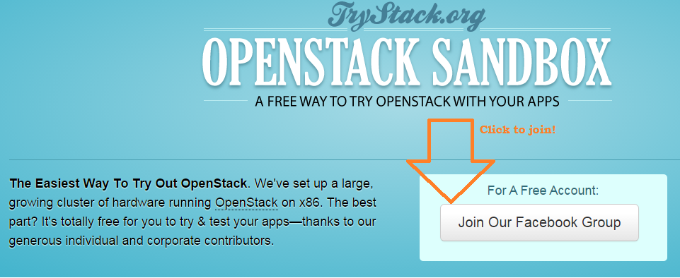
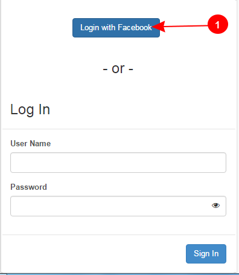
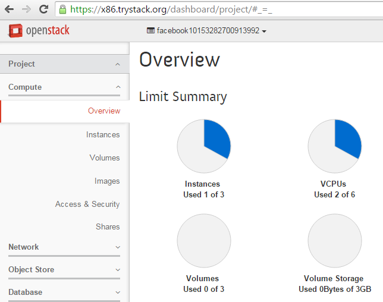
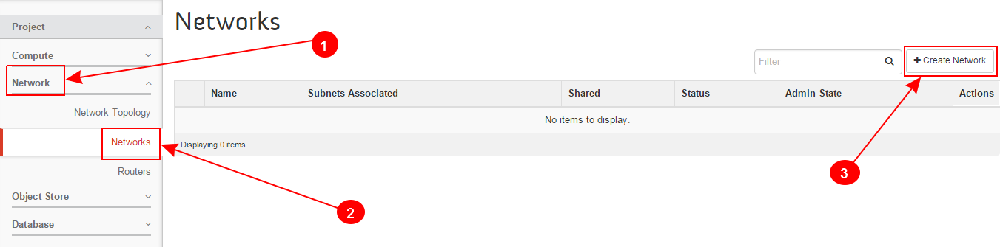
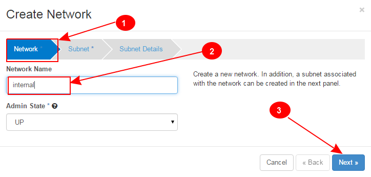
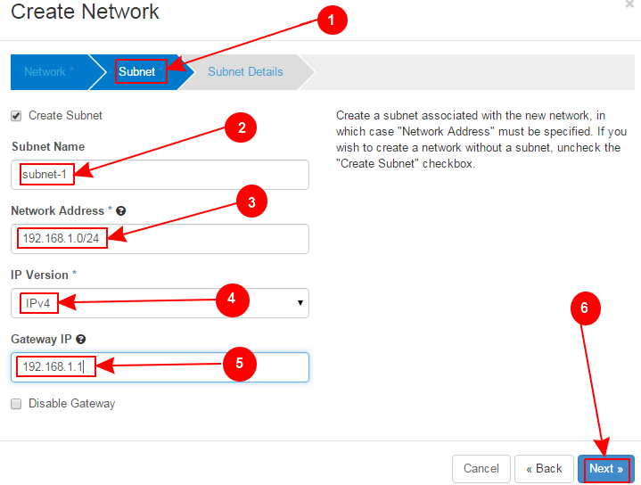
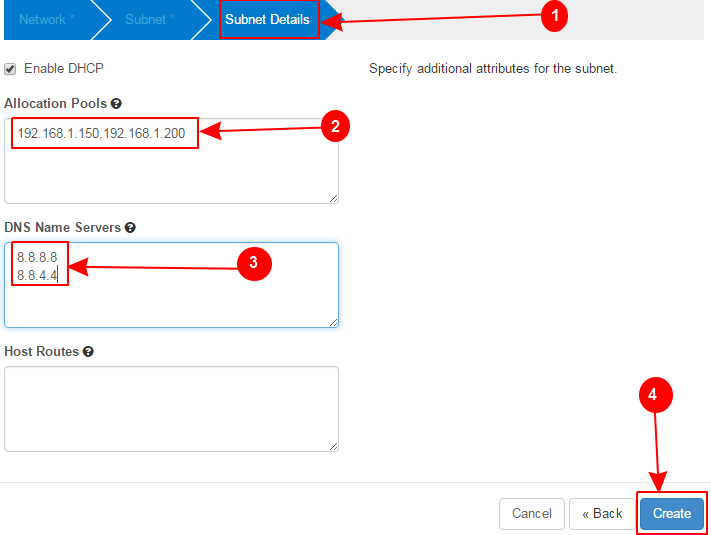
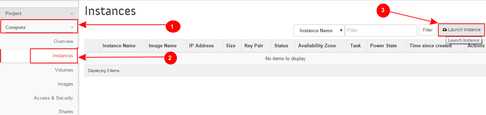
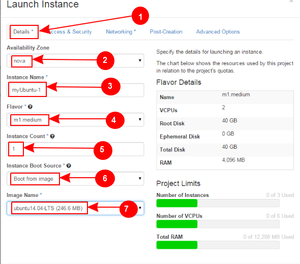
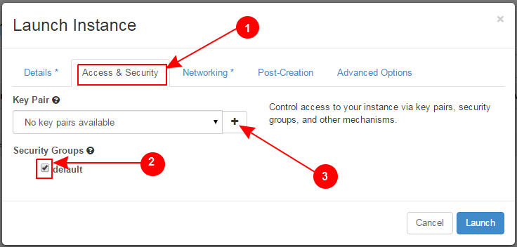
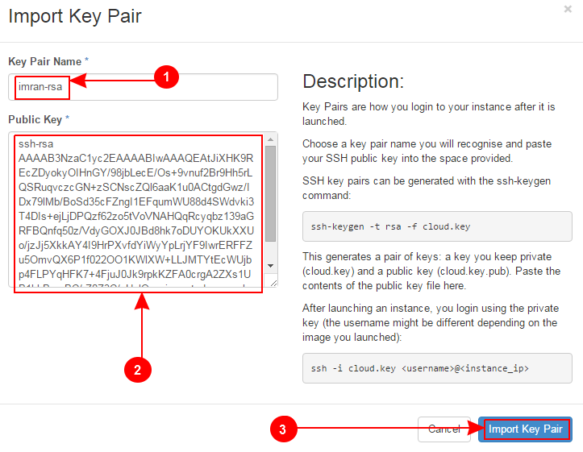
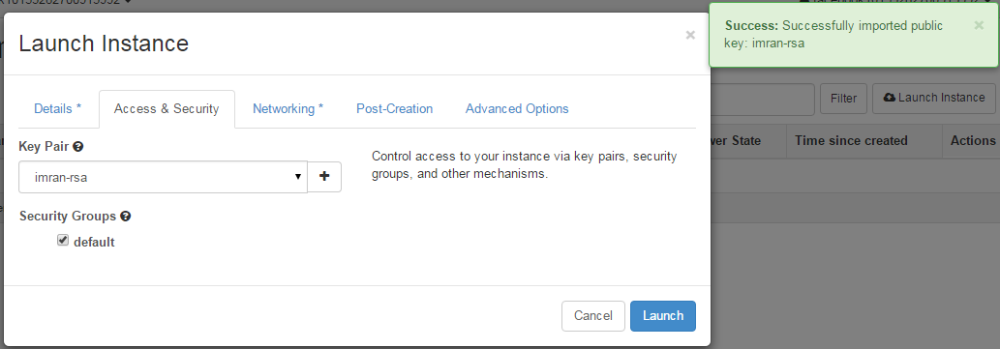
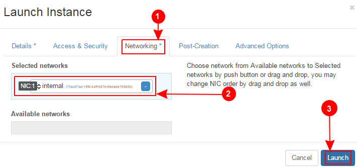
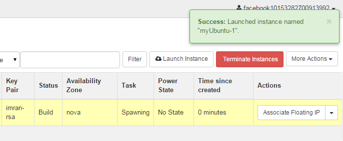
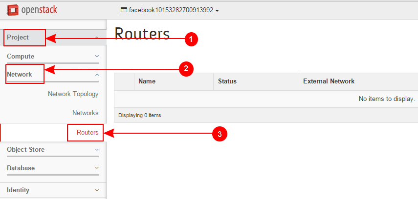
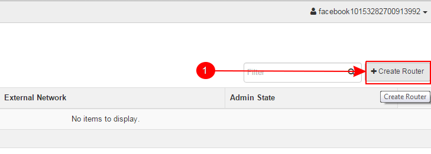
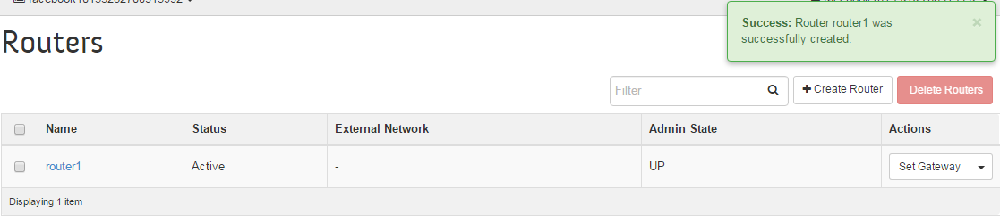
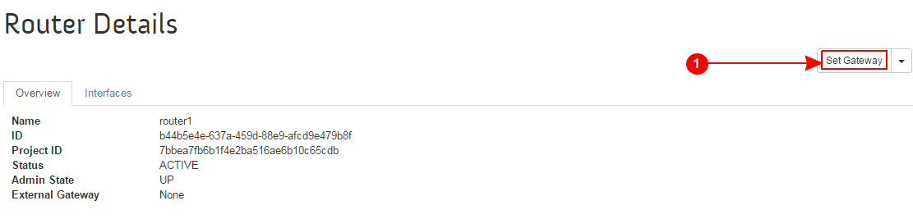
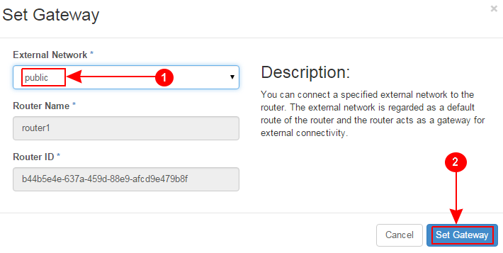
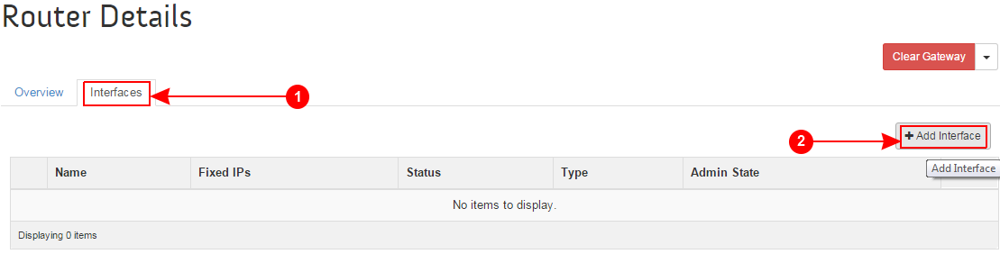
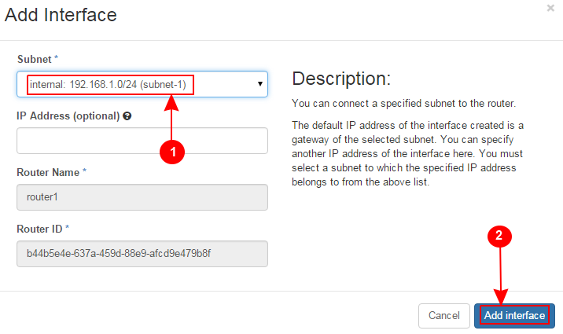
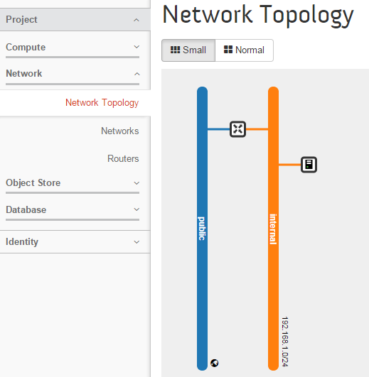
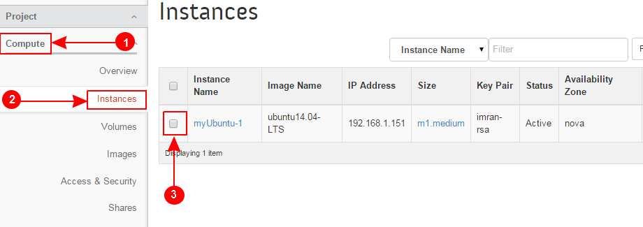
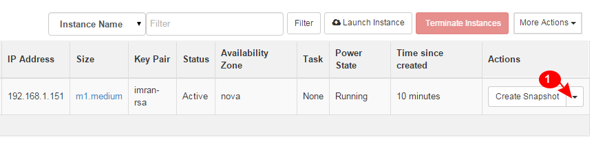
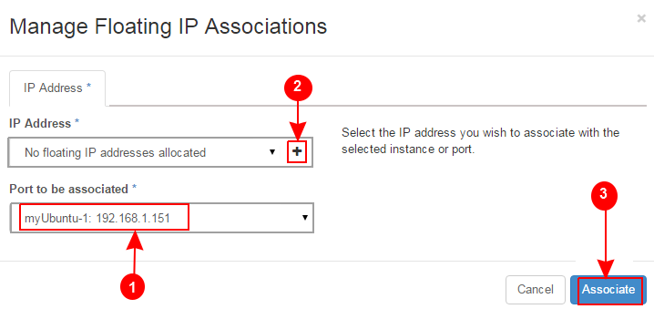
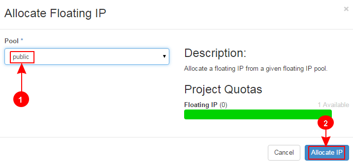
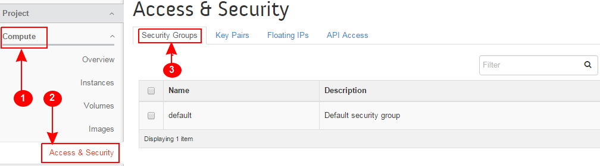
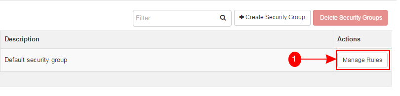
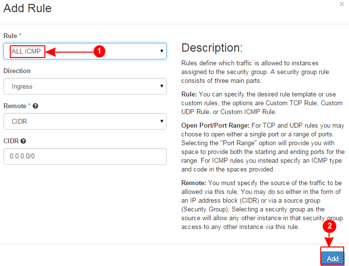
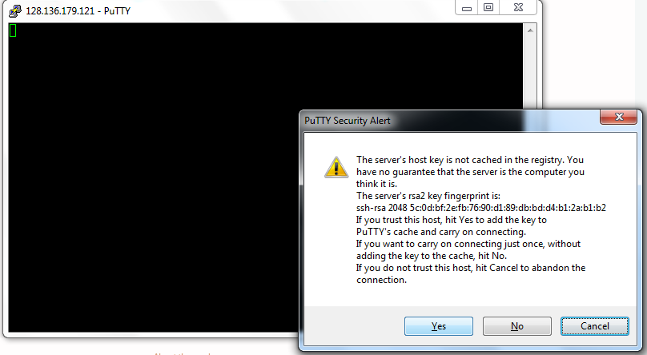
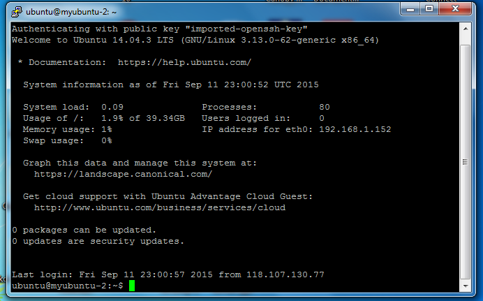