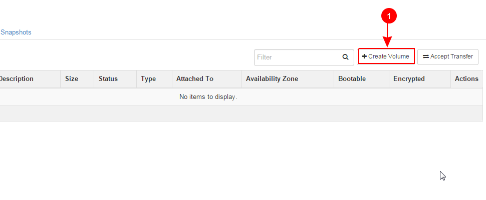

Learn OpenStack in 4 Hours
__________________________________

DAY-2: More OpenStack Magic !
---------------------------------------------------------------

In your previous interaction with OpenStack, you learned how to create a new virtual machine instance and associate it with a network.
We hope you enjoyed this! 

Today you will see OpenStack in more action. So let's get started 

Below are the learning objectives for today:

1. 	Creating an empty disk volume	

2.	 Creating a snapshot of a disk volume

3. 	 Attaching the empty disk volume to an instance

4.	Deleting a snapshot

5. 	Detaching a disk volume from a VM instance

6. 	Deleting a disk volume

7. 	Terminating a VM instance

1. Creating an Empty Volume
--------------------------------------

Before you get your hands dirty with creating disk volumes, you should first understand what a volume is .

Openstack provides several block storage types  and 'Volume Storage' is one of them.

Let's explain OpenStack storage types in a bit more depth.

You must know that OpenStack offers mainly two categories of block storage:

	1.  Ephemeral  storage

	2.  Persistent volumes 

Ephemeral Storage
==============

The life of instance guarentees the life of ephermeral storage. This means when the VM instance is deleted/terminated, the ephermeral storage will be deleted too. 

Below are few important facts you must remember about ephermeral storage:

	1.	Alghough ephermeral storage does not persist across deletions/terminations of VM instances however they persist across the reboots of the VM instance or the guiest operating system.

	2. 	Every instance must have some ephermeral storage.

	3.	The association of an emphermeral storage is unique. It can only be associated with a single instance at a time.
	
	4.	The size of ephermeral storage varies with the flavor of the instance.
	
	5.	Typically the root filesystem for a VM instance is created on ephermeral storage.

	6.	A few flavors provide more than one ephermeral storage disks with varying sizes. This is used by the guest operating system for creating filesystems and storing data.

Persistant Volume Storage
===================

Now you know what is an ephermeral disk storage in OpenStack terminology. Let' talk about a disk volume next.

	1.	These are virtualized block devices which are by default independent of any VM instance.
	
	2.	Volumes can be attached to single instance at a time. This means concurrent access from two VM instances at the same time is not possible. 
		However it is possible to detach a volume from one instance and attach it to another running instance.

 	3.	Since the volumes are custom created by the user, therefore they can be of any size depending upon the avaialbe quota and limits.

	4. 	By default, volumes are created with empty filesystems and as raw block devices.
	
	5.	Before formatting a volume or creating a filesystem on it, you need to attach it with an instance.

	6.	Volumes can be used in a same manner as an external disk.
 
	7.	You can have the disk volume even if you distroy the instance and its root disk.  

Ok. so far so good! Let's create a new disk volume.

	1. Goto  'Project'  and then 'Compute' and 'Volumes'

|image1|

	2. Next select 'Create Volume'  on the right top of the page.

|image2|

A popup menu will appear where you need to fillout the details for the new volume. 

	1. Set a meaningful volume name.

	2. Set a volume description

	3. Select 'No volume source , empty volume'  as we want to create an empty volume here.

	4. Select no volume type.

	5. Set the size of the volume in GB

	6. Select availability zone as 'Nova'

	7. Click on 'Create Volume'

This is depicted in the image below too:

|image3|

After creation of the volume, the newly created volume will be displayed on the volumes page.It may look like somthing below: 

|image4|

In this image, you can see that this volume is not attached to any instance and therfore the field 'Attached To' is empty. 

Remember that you can attach this volume to one isntance at a time. It is just like attaching an additional hard drive to your machine. 
You can however attach more than one volumes (hard drives) to your VM instance at the same time.

 Let's leave this new volume here and we will come back  laters and will attach it with one of our instances. 

2.  Create a Snapshot of a Volume
---------------------------------------------
Let's understand a few conceptual facts about Snapshots before we actually create one.

	1.	A snapshot is also a block storage that is persistant like a volume and can be created from a volume. 

	2.	In fact, it is a read-only image or copy of a volume that is taken in a specific point in time. 

	3.	A snapshot can be created from a volume that is available otherwise it is also possible to create a snapshot that is in use ( this is called forceful creation)

	4.	It is possible to create a new volume from a snapshot.

Ready? Let's go and create a new snapshot for our new volume that we just created.

	1. Click on the drop down menu under 'Actions' field in the row where the newly created volume is displayed.

	2. Select 'Create Snapshot' 

|image5|

A popup window will appear. You will need to fill out the details about the snapshopt as below:

	1.	A meaningful name for the snapshot

	2.	A description for the snapshot

	3.	Click on 'Create Volume Snapshot'

|image6|

3. Attach a Volume To an Instance
-------------------------------------------
Let's now come back to the volume that we had created but did not attach to any instance. 

So let's make use of it and attach it with our VM instance that we created at the first day.

Normally attached volumes act as secondary storage for the VM instances but they can also be used as primary storage in a few cases.

It is important to remember that volumes can not be attached to windows guests. In other words Hyper-V based VMs.

To attach a volume to your VM instance, you need to take the follwoing steps:

	1.	At the volumes page, go to the row for the volume you created earlier.

	2.	Click at the drop down menu under 'Actions' field 

	3. 	Select 'Manage Attachments'

This is also depicted in the image below:

|image7|

Now you will see a popup window asking for details.  Here you need to click on the drop down menu next to 'Attach to Instance' and then select the Ubuntu instance that you created before.

Next, click on 'Attach Volume'

The steps are also shown in the image below:

|image8|

Thats it !. Now you may see that the volume has been attached to your instance.  You will notice it under  'Attached To' column as highlighted in the next image:

|image9|

Congratulations! You attached a new volume to your instance. Now what next? You need to create a filesystem on this raw block device  and then mount this volume on a mount point 

Only after that you can see it as a regular disk and use it for storing data.

Login to your VM instance and run the following command :

$ fdisk -l

The newly attached volume will be displayed in addition to the existing disk volumes.  In some cases it will be attached as  /dev/vdb

You need to create a new partition on this volume and a filesystem before mounting it as a regular directory.

The mkfs command is what you need here to create a filesystem on this disk.  You may create an ext3 filessytem.  Let us talk about Linux filesystems here.

Introduction to File systems
====================

One of the basic concepts about Operating Systems is the filesystem. It is mechanism that is used by the Operating Systems to store data and files on the bare metal hardware. 

Just like windows uses FAT32 and NTFS, Linux on the other hand supports a variety of filesystems. In this regard, 'extended filesystem' EXT3 and EXT4 are most commonly used.

Computer understands machine code that is a combination of 1s and 0s . Each 1 or 0 is a bit and 8 bits are called a byte. Similarly a kilo byte is composed of  1024 bytes. 

A megabyte is 1024 kilobytes and a gigabyte is 1024 megabytes and so on. A  disk volume ( otherwise a hard drive) stores all these bytes and bits permenantly.  Each time you save a file to disk you are in fact writing several thousand 1s and 0s to the disk.

This combination of 1s and 0s which comprises large sized data, needs to be stored in an organized way so it can be accessed without any problem whenever required. This is just like a book system in a library which uses Dewey Decimal System to organize books.

The same goes to the filesystems on a disk volume. Windows uses NTFS and vFAT. Linux uses ext2, ext3, ext4, HPFS, and many more.

Journaling
=======

A journaling filesystem adds more reliability in the context of data storage on a disk volume. Although they do not prevent corruption however they have a few preventive measures to avoid inconsistencies and deploy a few mechanisms to perform file system checks.

For example when a system crashes due to a power failure, the files those were already opened by system applications will not be saved properly to the disck. This will result into data corruption and inconsistent filesystem.

Using a jouranl, the operating system creates an index of the data stored on the disk. when a file is being modified, the operating system does not just overwrite it in the same place however it saves it in another place and logs the changes into a file.

When the task is complete, it just commits the changes in the actual file and removes the log entry. Therefore the system is always in a consistent state.

Fragmentation
==========

Windows requires the disk to be defragmented once in a while so that the used blocks be shifted to one continuous region of the hard disk. This is not needed in case of Linux because it is designed this way.
Linux EXT3 filesystem was designed to keep the used blocks of files together or at least very close to each other. In EXT4 there are a few tools available for defragmenting the file system.

When ext3 was developed, it was coded so that it would keep blocks of files together or at least near each other.

No true defragmenting tools exist for the ext3 file system, but tools for defragmenting will be included with the ext4 file system.

Having said all this theoratical story about filesystems, let's create a new ext3 filesystem on the new volume you created earlier.

Suppose your new volume is shown as /dev/vdb  under  'fdisk -l' command.

Let us create a new partition  /dev/vdb1  on it.

Run the command:  "sudo fdisk  /dev/vdb"

Next prompt will be displayed. Type  'p'  to print the partition table.

Next  type 'm'  for getting help.  Now type 'n' to create a new partition table. 

To set the default type (primary), type 'p' and press enter. Next,  set a prtition number.  Let's put 1 in this case. Press enter.

Next,  set the partition starting blocks. Leave it as default and press enter. Next, set the partition ending blocks. Remember that we want our partition to occupy all free space hence the ending blocks should include the complete disk.

Press enter. To save the changes,  press 'w'  and press enter. This will bring you back to the shell command prompt.

You need to create  a filesystem on this new partition.  To do so,  type the command :  'sudo mkfs  -t ext3  /dev/vdb1' .  This will create a new filesystem of type ext3 on this partition.

Now you need to create a folder as mounting point for this partition.

You can use the 'mkdir' command to create a new directory that you will use as a mount point for this volume.

		$ sudo mkdir /mydiskvolume
		$ sudo mount /dev/vdb  /mydiskvolume

To verfiy that the disk has been mounted properly, run the below command:

		$ df -h

You can make the changes permenant by adding  a new line to the /etc/fstab file. The line should be something like below:

/dev/vdb1		/mydiskvolume	ext3	rw	0	0

Thats it!. You have successfully attached a new volume to your instance and also created a filesystem and then mounted on the system.

4.	Deleting a Snapshot
---------------------------------------
Why on earth someone needs to delete a snapshot? Well there are times when you have created several snapshots in different points in time. You may want to keep the latest snapshots and want to delete those which were taken a few months back.

So how to do it? Let's see it now.  
	
	a.	First of all go to the dashboard as always you do. Then goto compute --> Volumes  --> Volume Snapshots
	b. 	Click on  'Delete Volume Snapshot' on the right. A confirmation window will apear, select 'delete snapshot' again.

The same procedure is depicted in the image below:

|image11|

5. 	Detaching a Disk Volume from a VM Instance
-----------------------------------------------------------------------

Just as you can detach a physical hard drive from your machine, you can detach a disk volume from your VM. In case of a physical hard disk you need to make sure that the disk is un mounted first.

Same is the as case with a disk volume attached to a VM instance. First of all you must unmount it from the instance usiing the below command:

	$ sudo umount /dev/vdb      # (In this case /dev/vdb is the volume to be detached)

Now you can go to the OpenStack dashboard and under projects, goto compute. Select Volumes and then goto 'Manage Volumes' on the right in the same row where your newly created volume is displayed.

The same is depicted in the image below:

|image12|

Next, a popup window will appear. Click on 'Detach Volume' .  This will detach the volume from the instance. Now you can delete this volume if you think it is no longer needed.

Let's go to next section and see how to delte a disk volume.

6. 	Deleting a Disk Volume
-------------------------------------------

One of the major responsibilities of a cloud administrator is to keep the environment clean and free up any unused resources. Small or unused disk volumes can be sometimes deleted to free up space for creating larger volumes.

One of the advantages of a virtualized environment is that you can create volumes of different sizes. You can delete small volumes and free up some space and then combine all free space to create a new bigger volume.

To delete a disk volume  goto dashboard, projects --> compute --> volumes  and select the volume that you wanted to delete. (Make sure that the volume is detached already!)

Click on 'Delete Volumes' button on right top corner of the page. Then confirm deletion in the popup window. This will delete the disk volume.

The same procedure is depicted in the image below:

|image13|

7. 	Terminating a VM instance
-----------------------------------------------

At times you may need to terminate an instance to permenantly detele it. This will destroy everything including the data stored on its primary disk. However the secondary disk volumes attached to it will not be deleted.

	a.	You may terminate an instance using a similar procedure that you used to create it. Goto OpenStack dashboard then goto 'Compute' and then 'Instances'

	b.	Select the instance you want to terminate.

	c. 	Click on the button ' Terminate Instances'.  Click on 'Terminate Instances' again  in the confirmation window.

The same procedure is depicted in the below image:

|image14|

.. |image1| image:: media/d2_image1.png

.. |image3| image:: media/d2_image3.png
.. |image4| image:: media/d2_image4.png
.. |image5| image:: media/d2_image5.png
.. |image6| image:: media/d2_image6.png

.. |image9| image:: media/d2_image9.png
.. |image10| image:: media/d2_image10.png
.. |image11| image:: media/d2_image11.png
.. |image12| image:: media/d2_image12.png
.. |image13| image:: media/d2_image13.png

