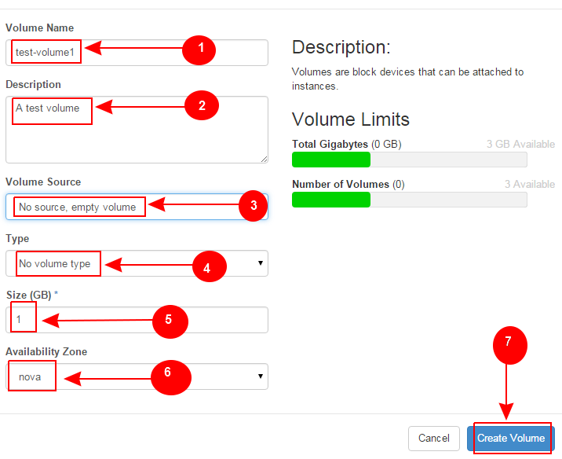

Learn OpenStack in 4 Hours
__________________________________

DAY-2: More OpenStack Magic !
---------------------------------------------------------------

In your previous interaction with OpenStack, you learned how to create a new virtual machine instance and associate it with a network.
We hope you enjoyed this! 

Today you will see OpenStack in more action. So let's get started 

Below are the learning objectives for today:

1. 	Creating an empty disk volume	

2.	 Creating a snapshot of a disk volume

3. 	 Attaching the empty disk volume to an instance

4.	Deleting a snapshot

5. 	Detaching a disk volume from a VM instance

6. 	Deleting a disk volume

7. 	Terminating a VM instance

1. Creating an Empty Volume
======================

Before you get your hands dirty with creating disk volumes, you should first understand what a volume is .

Openstack provides several storage types  and 'Volume Storage' is one of them.

Let's explain this in a bit more depth.

ing Guides Icehouse -  Training Guides Icehouse -  Training Guides Icehouse -  Training Guides Icehouse -  Training Guides Icehouse -  Training Guides Icehouse -  Training Guides Icehouse -  Training Guides Icehouse - 
 Chapter 5. Compute Node

Contents

Day 1, 15:00 to 17:00
VM Placement
VM provisioning in-depth
OpenStack Block Storage
Administration Tasks
 Day 1, 15:00 to 17:00

 VM Placement

Compute uses the nova-scheduler service to determine how to dispatch compute and volume requests. For example, the nova-scheduler service determines which host a VM should launch on. The term host, in the context of filters, means a physical node that has the nova-compute service running on it. You can configure the scheduler through a variety of options.

 
Figure 5.1. Nova

Just as shown by the above figure, nova-scheduler interacts with other components through the queue and central database repo. For scheduling, the queue is the essential communications hub.

All compute nodes (also known as hosts in terms of OpenStack) periodically publish their status, resources available and hardware capabilities to nova-scheduler through the queue. Nova-scheduler then collects this data and uses it to make decisions when a request comes in.

By default, the compute scheduler is configured as a filter scheduler, as described in the next section. In the default configuration, this scheduler considers hosts that meet all of the following criteria:

Are in the requested availability zone (AvailabilityZoneFilter).

Have sufficient RAM available (RamFilter).

Are capable of servicing the request (ComputeFilter).

Filter Scheduler

The Filter Scheduler supports filtering and weighting to make informed decisions on where a new instance should be created. This Scheduler only supports working with Compute Nodes.

Filtering

 
Figure 5.2. Filtering

During its work, Filter Scheduler first makes a dictionary of unfiltered hosts, then filters them using filter properties and finally chooses hosts for the requested number of instances (each time it chooses the most weighed host and appends it to the list of selected hosts).

If it turns up that it can’t find candidates for the next instance, it means that there are no more appropriate hosts where the instance could be scheduled.

If we speak about filtering and weighting, their work is quite flexible in the Filter Scheduler. There are a lot of filtering strategies for the Scheduler to support. Also you can even implement your own algorithm of filtering.

There are some standard filter classes to use (nova.scheduler.filters):

AllHostsFilter - This filter does no operation. It passes all the available hosts.

ImagePropertiesFilter - filters hosts based on properties defined on the instance’s image. It passes hosts that can support the specified image properties contained in the instance.

AvailabilityZoneFilter - filters hosts by availability zone. It passes hosts matching the availability zone specified in the instance properties.

ComputeCapabilitiesFilter - checks that the capabilities provided by the host Compute service satisfy any extra specifications associated with the instance type. It passes hosts that can create the specified instance type.

The extra specifications can have a scope at the beginning of the key string of a key/value pair. The scope format is scope:key and can be nested, i.e. key_string := scope:key_string. Example like capabilities:cpu_info: features is valid scope format. A key string without any : is non-scope format. Each filter defines its valid scope, and not all filters accept non-scope format.

The extra specifications can have an operator at the beginning of the value string of a key/value pair. If there is no operator specified, then a default operator of s== is used. Valid operators are:

* = (equal to or greater than as a number; same as vcpus case)* == (equal to as a number)* != (not equal to as a number)* >= (greater than or equal to as a number)* <= (less than or equal to as a number)* s== (equal to as a string)* s!= (not equal to as a string)* s>= (greater than or equal to as a string)* s> (greater than as a string)* s<= (less than or equal to as a string)* s< (less than as a string)* <in> (substring)* <or> (find one of these)Examples are: ">= 5", "s== 2.1.0", "<in> gcc", and "<or> fpu <or> gpu"

class RamFilter(filters.BaseHostFilter):
  """Ram Filter with over subscription flag"""

  def host_passes(self, host_state, filter_properties):
  """Only return hosts with sufficient available RAM."""

    instance_type = filter_properties.get('instance_type')
    requested_ram = instance_type['memory_mb']
    free_ram_mb = host_state.free_ram_mb
    total_usable_ram_mb = host_state.total_usable_ram_mb
    used_ram_mb = total_usable_ram_mb - free_ram_mb
    return total_usable_ram_mb * FLAGS.ram_allocation_ratio - used_ram_mb >= requested_ram
Here ram_allocation_ratio means the virtual RAM to physical RAM allocation ratio (it is 1.5 by default). Really, nice and simple.

The next standard filter to describe is AvailabilityZoneFilter and it isn’t difficult. This filter just looks at the availability zone of compute node and availability zone from the properties of the request. Each Compute service has its own availability zone, so that deployment engineers have an option to run scheduler with availability zones support and can configure availability zones on each compute host. This classes method host_passes returns True if the availability zone mentioned in the request is the same on the current compute host.

The ImagePropertiesFilter filters hosts based on the architecture, hypervisor type, and virtual machine mode specified in the instance. E.g., an instance might require a host that supports the arm architecture on a qemu compute host. The ImagePropertiesFilter will only pass hosts that can satisfy this request. These instance properties are populated from properties defined on the instance’s image. E.g. an image can be decorated with these properties using glance image-update img-uuid --property architecture=arm --property hypervisor_type=qemu Only hosts that satisfy these requirements will pass the ImagePropertiesFilter.

ComputeCapabilitiesFilter checks if the host satisfies any extra_specs specified on the instance type. The extra_specs can contain key/value pairs. The key for the filter is either non-scope format (i.e. no : contained), or scope format in capabilities scope (i.e. capabilities:xxx:yyy). One example of capabilities scope is capabilities:cpu_info:features, which will match host’s cpu features capabilities. The ComputeCapabilitiesFilter will only pass hosts whose capabilities satisfy the requested specifications. All hosts are passed if no extra_specs are specified.

ComputeFilter is quite simple and passes any host whose Compute service is enabled and operational.

Now we are going to the IsolatedHostsFilter. There can be some special hosts reserved for specific images. These hosts are called isolated. The images to run on the isolated hosts are also called isolated. This Scheduler checks if the image_isolated flag named in instance specifications is the same that the host has.

Weights

Filter Scheduler uses so-called weights during its work.

The Filter Scheduler weighs hosts based on the config option scheduler_weight_classes, this defaults to nova.scheduler.weights.all_weighers, which selects the only weigher available – the RamWeigher. Hosts are then weighed and sorted with the largest weight winning.

Filter Scheduler finds local list of acceptable hosts by repeated filtering and weighing. Each time it chooses a host, it virtually consumes resources on it, so subsequent selections can adjust accordingly. It is useful if the customer asks for the same large amount of instances, because weight is computed for each instance requested.

 
Figure 5.3. Weights

In the end Filter Scheduler sorts selected hosts by their weight and provisions instances on them.

 VM provisioning in-depth

The request flow for provisioning an instance goes like this:

The dashboard or CLI gets the user credentials and authenticates with the Identity Service via REST API.

The Identity Service authenticates the user with the user credentials, and then generates and sends back an auth-token which will be used for sending the request to other components through REST-call.

The dashboard or CLI converts the new instance request specified in launch instance or nova-boot form to a REST API request and sends it to nova-api.

nova-api receives the request and sends a request to the Identity Service for validation of the auth-token and access permission.

The Identity Service validates the token and sends updated authentication headers with roles and permissions.

nova-api checks for conflicts with nova-database.

nova-api creates initial database entry for a new instance.

nova-api sends the rpc.call request to nova-scheduler expecting to get updated instance entry with host ID specified.

nova-scheduler picks up the request from the queue.

nova-scheduler interacts with nova-database to find an appropriate host via filtering and weighing.

nova-scheduler returns the updated instance entry with the appropriate host ID after filtering and weighing.

nova-scheduler sends the rpc.cast request to nova-compute for launching an instance on the appropriate host.

nova-compute picks up the request from the queue.

nova-compute sends the rpc.call request to nova-conductor to fetch the instance information such as host ID and flavor (RAM, CPU, Disk).

nova-conductor picks up the request from the queue.

nova-conductor interacts with nova-database.

nova-conductor returns the instance information.

nova-compute picks up the instance information from the queue.

nova-compute performs the REST call by passing the auth-token to glance-api. Then, nova-compute uses the Image ID to retrieve the Image URI from the Image Service, and loads the image from the image storage.

glance-api validates the auth-token with keystone.

nova-compute gets the image metadata.

nova-compute performs the REST-call by passing the auth-token to Network API to allocate and configure the network so that the instance gets the IP address.

neutron-server validates the auth-token with keystone.

nova-compute retrieves the network info.

nova-compute performs the REST call by passing the auth-token to Volume API to attach volumes to the instance.

cinder-api validates the auth-token with keystone.

nova-compute retrieves the block storage info.

nova-compute generates data for the hypervisor driver and executes the request on the hypervisor (via libvirt or API).

 
Figure 5.4. Nova VM provisioning

 OpenStack Block Storage

Block Storage and OpenStack Compute

OpenStack provides two classes of block storage, "ephemeral" storage and persistent "volumes". Ephemeral storage exists only for the life of an instance, it will persist across reboots of the guest operating system but when the instance is deleted so is the associated storage. All instances have some ephemeral storage. Volumes are persistent virtualized block devices independent of any particular instance. Volumes may be attached to a single instance at a time, but may be detached or reattached to a different instance while retaining all data, much like a USB drive.

Ephemeral Storage

Ephemeral storage is associated with a single unique instance. Its size is defined by the flavor of the instance.

Data on ephemeral storage ceases to exist when the instance it is associated with is terminated. Rebooting the VM or restarting the host server, however, will not destroy ephemeral data. In the typical use case an instance's root filesystem is stored on ephemeral storage. This is often an unpleasant surprise for people unfamiliar with the cloud model of computing.

In addition to the ephemeral root volume all flavors except the smallest, m1.tiny, provide an additional ephemeral block device varying from 20G for the m1.small through 160G for the m1.xlarge by default - these sizes are configurable. This is presented as a raw block device with no partition table or filesystem. Cloud aware operating system images may discover, format, and mount this device. For example the cloud-init package included in Ubuntu's stock cloud images will format this space as an ext3 filesystem and mount it on /mnt. It is important to note this a feature of the guest operating system. OpenStack only provisions the raw storage.

Volume Storage

Volume storage is independent of any particular instance and is persistent. Volumes are user created and within quota and availability limits may be of any arbitrary size.

When first created volumes are raw block devices with no partition table and no filesystem. They must be attached to an instance to be partitioned and/or formatted. Once this is done they may be used much like an external disk drive. Volumes may attached to only one instance at a time, but may be detached and reattached to either the same or different instances.

It is possible to configure a volume so that it is bootable and provides a persistent virtual instance similar to traditional non-cloud based virtualization systems. In this use case the resulting instance may still have ephemeral storage depending on the flavor selected, but the root filesystem (and possibly others) will be on the persistent volume and thus state will be maintained even if the instance is shutdown. Details of this configuration are discussed in theOpenStack End User Guide.

Volumes do not provide concurrent access from multiple instances. For that you need either a traditional network filesystem like NFS or CIFS or a cluster filesystem such as GlusterFS. These may be built within an OpenStack cluster or provisioned outside of it, but are not features provided by the OpenStack software.

A disk volume is a block storage device that you can connect to an instance as a persistant storage. Disk volumes can be attached to instances while the instance is running.
Similarly they can be detached in the same manner. 

A disk volume resembles a physical hard disk in practical life.  You can attach and format it as you format a physical disk. You can create a filesystem over it , mount it on a mount point and store data on it.

You can have the disk volume even if you distroy the instance and its root disk.  This make it possible to keep data on a volume even if you no longer need to keep the VM instance.

Let's create a new disk volume.

	1. Goto  'Project'  and then 'Compute' and 'Volumes'
|image1|
	2. Next select 'Create Volume'  on the right top of the page.

|image2|

A popup menu will appear where you need to fillout the details for the new volume. 
	1. Set a meaningful volume name.

	2. Set a volume description

	3. Select 'No volume source , empty volume'  as we want to create an empty volume here.

	4. Select no volume type.

	5. Set the size of the volume in GB

	6. Select availability zone as 'Nova'

	7. Click on 'Create Volume'

This is depicted in the image below too:

|image3|

After creation of the volume, the newly created volume will be displayed on the volumes page.It may look like somthing below: 

In this image, you can see that this volume is not attached to any instance and therfore the field 'Attached To' is empty. 

|image4|

So let's attach this volume to an instance.

2.  Create a Snapshot of a Volume
=========================

	1. Click on the drop down menu under 'Actions' field in the row where the newly created volume is displayed.
	2. Select 'Create Snapshot' 

|image5|

3. Attach a Volume To an Instance
=========================

.. |image1| image:: media/d2_image1.png
.. |image2| image:: media/d2_image2.png

.. |image4| image:: media/d2_image4.png
.. |image5| image:: media/d2_image5.png
