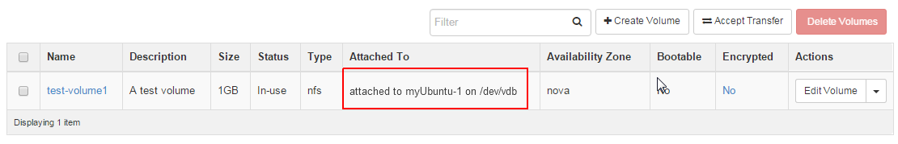

Learn OpenStack in 4 Hours
__________________________________

DAY-2: More OpenStack Magic !
---------------------------------------------------------------

In your previous interaction with OpenStack, you learned how to create a new virtual machine instance and associate it with a network.
We hope you enjoyed this! 

Today you will see OpenStack in more action. So let's get started 

Below are the learning objectives for today:

1. 	Creating an empty disk volume	

2.	 Creating a snapshot of a disk volume

3. 	 Attaching the empty disk volume to an instance

4.	Deleting a snapshot

5. 	Detaching a disk volume from a VM instance

6. 	Deleting a disk volume

7. 	Terminating a VM instance

1. Creating an Empty Volume
--------------------------------------

Before you get your hands dirty with creating disk volumes, you should first understand what a volume is .

Openstack provides several block storage types  and 'Volume Storage' is one of them.

Let's explain OpenStack storage types in a bit more depth.

You must know that OpenStack offers mainly two categories of block storage:

	1.  Ephemeral  storage

	2.  Persistent volumes 

Ephemeral Storage
==============

The life of instance guarentees the life of ephermeral storage. This means when the VM instance is deleted/terminated, the ephermeral storage will be deleted too. 

Below are few important facts you must remember about ephermeral storage:

	1.	Alghough ephermeral storage does not persist across deletions/terminations of VM instances however they persist across the reboots of the VM instance or the guiest operating system.

	2. 	Every instance must have some ephermeral storage.

	3.	The association of an emphermeral storage is unique. It can only be associated with a single instance at a time.
	
	4.	The size of ephermeral storage varies with the flavor of the instance.
	
	5.	Typically the root filesystem for a VM instance is created on ephermeral storage.

	6.	A few flavors provide more than one ephermeral storage disks with varying sizes. This is used by the guest operating system for creating filesystems and storing data.

Persistant Volume Storage
===================

Now you know what is an ephermeral disk storage in OpenStack terminology. Let' talk about a disk volume next.

	1.	These are virtualized block devices which are by default independent of any VM instance.
	
	2.	Volumes can be attached to single instance at a time. This means concurrent access from two VM instances at the same time is not possible. 
		However it is possible to detach a volume from one instance and attach it to another running instance.

 	3.	Since the volumes are custom created by the user, therefore they can be of any size depending upon the avaialbe quota and limits.

	4. 	By default, volumes are created with empty filesystems and as raw block devices.
	
	5.	Before formatting a volume or creating a filesystem on it, you need to attach it with an instance.

	6.	Volumes can be used in a same manner as an external disk.
 
	7.	You can have the disk volume even if you distroy the instance and its root disk.  

Ok. so far so good! Let's create a new disk volume.

	1. Goto  'Project'  and then 'Compute' and 'Volumes'

|image1|

	2. Next select 'Create Volume'  on the right top of the page.

|image2|

A popup menu will appear where you need to fillout the details for the new volume. 

	1. Set a meaningful volume name.

	2. Set a volume description

	3. Select 'No volume source , empty volume'  as we want to create an empty volume here.

	4. Select no volume type.

	5. Set the size of the volume in GB

	6. Select availability zone as 'Nova'

	7. Click on 'Create Volume'

This is depicted in the image below too:

|image3|

After creation of the volume, the newly created volume will be displayed on the volumes page.It may look like somthing below: 

|image4|

In this image, you can see that this volume is not attached to any instance and therfore the field 'Attached To' is empty. 

2.  Create a Snapshot of a Volume
---------------------------------------------
Let's understand a few conceptual things about Snapshots before we actually create one.

	1.	A snapshot is also a block storage that is persistant like a volume and can be created from a volume. 

	2.	In fact, it is a read-only image or copy of a volume that is taken in a specific point in time. 

	3.	A snapshot can be created from a volume that is available otherwise it is also possible to create a snapshot that is in use ( this is called forceful creation)

	4.	A new volume can be created using a snapshot as well.

Action time ! Let's create a volume !

	1. Click on the drop down menu under 'Actions' field in the row where the newly created volume is displayed.

	2. Select 'Create Snapshot' 

|image5|

A popup window will appear. You will need to fill out the details about the snapshopt as below:

	1.	A meaningful name for the snapshot

	2.	A description for the snapshot

	3.	Click on 'Create Volume Snapshot'

|image6|

3. Attach a Volume To an Instance
-------------------------------------------
As you may remember that you had created a volume earlier but that volume is not being used by any instance. 

So let's make use of it and attach it with our Ubuntu instance that we created at the first day.

Normally attached volumes act as secondary storage for the VM instances but they can also be used as primary storage in a few cases.

To attach a volume to your Ubuntu instance, see you need to taking follwoing steps:

	1.	At the volumes page, go to the row for the volume you created earlier.

	2.	Click at the drop down menu under 'Actions' field 

	3. 	Select 'Manage Attachments'

This is also depicted in the image below:

|image7|

Now you will see a popup window asking for details.  Here you need to click on the drop down menu next to 'Attach to Instance' and then select the Ubuntu instance that you created before.

Next, click on 'Attach Volume'

The steps are also shown in the image below:

|image8|

Now you may see that the volume has been attached to your instance.  You will notice it under  'Attached To' column as highlighted in the next image:

|image9|

Congratulations! You attached a new volume to your instance. Now what next? You need to create a filesystem on this raw block device  and then mount this volume on a mount point 

Only after that you can see it as a regular disk and use it for storing data.

The mkfs command is what you need here to create a filesystem on this disk.  You may create an ext3 filessytem.  Ok let's talk about Linux filesystems here.

Introduction to File systems
====================

File systems are one of the things any newcomer to linux must become acquainted with. In the world of Microsoft you never really have to worry about it, the default being NTFS. Linux however, being built on a world of open source and differing opinions, is not limited in this way and so the user should have an understanding of what a file system is, and how it affects the computer.

At the core of a computer, it's all 1s and 0s, but the organization of that data is not quite as simple. A bit is a 1 or a 0, a byte is composed of 8 bits, a kilobyte is 1024 (i.e. 2^10) bytes, a megabyte is 1024 kilobytes and so on and so forth. All these bits and bytes are permanently stored on a Hard Drive. A hard drive stores all your data, any time you save a file, you're writing thousands of 1s and 0s to a metallic disc, changing the magnetic properties that can later be read as 1 or 0. There is so much data on a hard drive that there has to be some way to organize it, like a library of books and the old card drawers that indexed all of them, without that index, we'd be lost. Libraries, for the most part, use the Dewey Decimal System to organize their books, but there exist other systems to do so, none of which have attained the same fame as Mr. Dewey's invention. File systems are the same way. The ones most users are aware of are the ones Windows uses, the vFat or the NTFS systems, these are the Windows default file systems.

There are several different attributes which are necessary in defining file systems, these include their max file size, max partition size, whether they journal or not.

Journaling
=======

A journaling file system is more reliable when it comes to data storage. Journaling file systems do not necessarily prevent corruption, but they do prevent inconsistency and are much faster at file system checks than non-journaled file systems. If a power failure happens while you are saving a file, the save will not complete and you end up with corrupted data and an inconsistent file system. Instead of actually writing directly to the part of the disk where the file is stored, a journaling file system first writes it to another part of the hard drive and notes the necessary changes to a log, then in the background it goes through each entry to the journal and begins to complete the task, and when the task is complete, it checks it off on the list. Thus the file system is always in a consistent state (the file got saved, the journal reports it as not completely saved, or the journal is inconsistent (but can be rebuilt from the file system)). Some journaling file systems can prevent corruption as well by writing data twice.

You can use the 'mkdir' command to create a new directory that you will use as a mount point for this volume.

		mkdir /mydiskvolume
		mount /dev/vdb  /mydiskvolume

.. |image1| image:: media/d2_image1.png
.. |image2| image:: media/d2_image2.png
.. |image3| image:: media/d2_image3.png
.. |image4| image:: media/d2_image4.png
.. |image5| image:: media/d2_image5.png
.. |image6| image:: media/d2_image6.png
.. |image7| image:: media/d2_image7.png
.. |image8| image:: media/d2_image8.png

.. |image10| image:: media/d2_image10.png

.. |image14| image:: media/d2_image14.png
