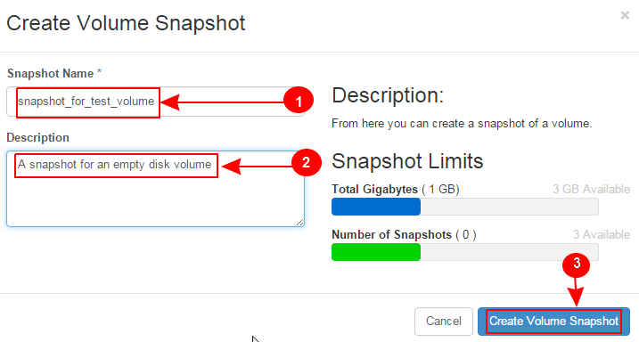

Learn OpenStack in 4 Hours
__________________________________

DAY-2: More OpenStack Magic !
---------------------------------------------------------------

In your previous interaction with OpenStack, you learned how to create a new virtual machine instance and associate it with a network.
We hope you enjoyed this! 

Today you will see OpenStack in more action. Below are the learning objectives for today:

1. 	Creating an empty disk volume

2.	 Attaching the empty disk volume to an instance

3.	 Creating a snapshot of a disk volume

4. 	Deleting a snapshot

5. 	Detaching a disk volume from a VM instance

6. 	Deleting a disk volume

7. 	Terminating a VM instance

|image1|

|image2|

|image3|

|image4|

|image5|

|image6|

.. |image1| image:: media/d2_image1.png
.. |image2| image:: media/d2_image2.png
.. |image3| image:: media/d2_image3.png
.. |image4| image:: media/d2_image4.png
.. |image5| image:: media/d2_image5.png

