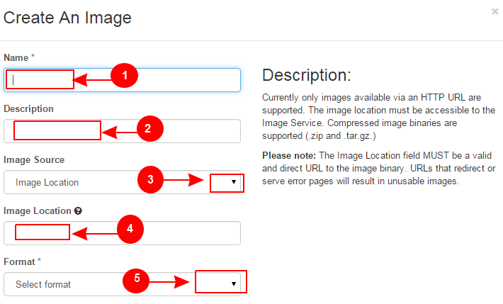

Learn OpenStack in 4 Hours
___________________________

DAY-3: More Funny Things Ahead .................! 
---------------------------------------------------------------------------------------------

In the earlier session, you worked with disk volumes and snapshots. We hope you gained some useful information from that session.

Today we will take you to another advanced level of OpenStack operations. This session will focus on :

	1.	Working with Images

	2.	Working with Containers

	3.	Tightening your Security

	4.	Working with Databases

	

1.	Working with Images
-----------------------------------------

Talking in context of OpenStack, an image or otherwise a virtual machine image is nothing but a virtual disk file containing a bootable operating system. 
OpenStack uses an image as a source to create a new virtual machine instance. As a cloud adminstrator or a user you may need to upload and maintain VM images for your cloud.
Both OpenStack dashboard as well as command line tools can be used to manage images for the cloud.

Please note that, besides command line tools like 'glance' and 'nova; you can also use the necessary APIs to maintain images.

Never confuse when you hear people saying , images or virtual machine images or virtual appliances. 
They all simply mean a virtual machine image. For simplification we will use the term 'image' to refer to virtual machine image or a virtual appliance.

In fact, without an image, the Openstack cloud is not very purposeful. So images have vital importance!

Before actually using the methods to maintain images, you must know the types and formats of images used in virtualized environments.

Images come in various formats because of the variety of hypervisors available today. Below are a few major image formats:

Raw
===

As the name indicates, this is the most simplest form of an image. KVM and Xen hypervisors love it ( and ofcourse they support it!) 
It is infact a block device file just like one created using the 'dd' command. 

We do not ask you to always use dd comand to create a raw disk image as we will discuss laters on how to create a raw image. 

qcow2
=====

QCOW2 stands for QEMU copy-on-write version 2. KVM hypervisor uses this format very commonly. There are some enhanced features provided by qcow2 over raw format which are:

	a.	It uses sparse representation which results into a smaller image size.

	b.	It supports creating disk snapshots

	c.	Due to being smaller in size, it takes less time to upload.

	d. 	OpenStack will automatically convert a raw image into qcow2 as it supports snapshots. (which is not the case with raw images)
	

AMI/AKI/ARI
========

It was the first format that was supported by Amazon Elastic Compute Cloud (Amazon EC2). The three files are:

	a.	AMI (Amazon Machine Image) is the image in raw format.
	
	b.	AKI (Amazon Kernel Image) it is the kernel ( vmlinuz) file which is laoded by the linux kernel for booting.
	
	c.	ARI (Amazon Ramdisk Image) is the ramdisk (initrd) file optionally mounted at boot time. 

UEC tarball
========

Ubuntu Enterprise Cloud (UEC)  is the tar file which contains an AMI/AKI/ARI bundle, packaged and gzipped into a single tar file.

UEC was initially build using Ubuntu and Eucalyptus cloud framework which was later on replaced with OpenStack.

VMDK
=====

Virtual Machine Disk (VMDK) format is used by VMWare's ESXi hypervisor.

VDI
====

Virtual Disk Image is a format used by VirtualBox. OpenStack Compute hypervisors do not support it straight forward. You need to convert it to qcow2 or raw to be able to use it with OpenStack.

VHD
====

Virtual Hard Disk (VHD) format is used by Microsoft Hyper-V

VHDX
====

VHDX is an upgraded version of VHD that can support larger disk size and also provides features to guard against data corruption during power failures.

OVF
===

Distributed Management Task Force (DMTF) devised the Open Virtualization Format (OVF).  OpenStack Compute does not directly support OVF packages.
You will need to  extract the image file(s) from an OVF package to be able to use it with OpenStack.

ISO
===

It is the image file format most commonly used for CDs and DVDs. But since an ISO contains a bootable filesystem along with an operating system, it can be used as a virtual machine image.

Now let's get back to practical work and upload an image to our OpenStack cloud.

1.1	Upload An Image
-------------------------------------

Follow this procedure to upload an image to a project:

Log in to the dashboard as you did before.

Under the project tab, go to compute and click on images..

This will display the images page as displayed in the screenshot below:

|image1|

Click Create Image.

The 'Create An Image' dialog box appears.

Enter the following values:

	a.	Name		A meaningful name for the image

	b.	Description	Enter a brief description of the image.

	c.	Image Source	Choose an image source. This could be "Image Location"  or "Image File". . 
		
				If  you are downloading from Internet then select Image location otherwise if you are loading it from local disk then select image file.
	
	e.	Format		This is the image format either qcow2 or raw..

Below screenshot depicts the steps:

|image2|

	f.	Architecture			:	This can be for example  i386 for a 32-bit architecture or x86_64 for a 64-bit architecture.
	
	g.	Minimum Disk (GB) and Minimum RAM (MB) :	You may leave it as empty.
	
	h.	Copy Data			:	If enabled, it will copy image data to the Image service.
	
	i.	Public				:	If enabled, it will make the image public to all users with access to the current project.
	
	j.	Protected		 		:	If enabled, it will ensure that only users with permissions can delete the image.

Click Create Image.

The steps are also depicted in the screenshot  below:

|image3|

You have put this image in queue waiting to be uploaded. After some time it will change it status from 'Queued' to 'Active'.

1.2	Delete an Image
------------------------------------

Remember that this action is permanent and it will delete the image from your cloud. It can not be reversed. Also deletion needs appropriate permissions.

	a.	Log in to the dashboard or skip if you have already logged in.

	b.	Under the project tab, go to compute and click on images..

	c.	This will display the images page.

	d.	Select one or more images that you want to delete.

	e.	Click Delete Images.

The steps are shown in the below screenshot as well

|image4|

In the 'Confirm Delete Images' dialog box, click 'Delete Images' to confirm the deletion.

2.	Working With Containers
---------------------------------------------------------

You may think of containers as folders in windows or Linux. However there is one fundamental difference: Containers can not be nested! This means a container can not be created inside another container.

Container is a form of object storage because it consists of  data as well as metadata that is related to the stored data.

Let's jump into it and create a container.

Create a container
=============

	a.	Goto the 'Containers' option under 'Object Store' on the left.

	b.	Click Create Container.

	c.	In the Create Container dialog box, enter a name for the container, and then click Create Container.

You have successfully created a container.

Let's upload an object to the container now:

Upload an object
============

	a.	Goto the 'Containers' option under 'Object Store' on the left.

	b.	Click Create Container.

	c.	Select the container in which you want to store your object.

	d.	Click Upload Object.

	e.	The Upload Object To Container: <name> dialog box appears. ``<name>`` is the name of the container to which you are uploading the object.

	f.	Enter a name for the object.

	g.	Browse to and select the file that you want to upload.

	h.	Click Upload Object.

You have successfully uploaded an object to the container

Now let's update a container with new fiiles:

Edit an object
==========

	a.	Goto the 'Containers' option under 'Object Store' on the left.

	b.	Select the container that you want to edit.

	c.	Click 'More' and choose 'Edit' from the dropdown list.

	d.	The 'Edit Object' dialog box is displayed.

	e.	Browse to and select the file that you want to upload.

	f.	Click Update Object.

Let's have some more fun with containers. This time we will copy an object from one container to another. 

Before we do that you need to create a second container.

Copy an Object from one container to another
==================================
Once you have ceated two or more containers, you can use the below procedure:

	a.	Goto the 'Containers' option under 'Object Store' on the left.

	b.	Select the container that contains your source object.

	c.	Click More and choose Copy from the dropdown list.

	d.	In the Copy Object launch dialog box, enter the following values:

	e.	Destination Container: Choose the destination container from the list.

	f.	Path: Specify a path in which the new copy should be stored inside of the selected container.

	g.	Destination object name: Enter a name for the object in the new container.

	h.	Click Copy Object.

Thats it! you copied objects beteen containers.  Now let's talk about securing the VM instances:

3.	Tightening Your Security
---------------------------------------------

Security Groups and Rules
====================

OpenStack provides a feature called security groups. A security group is like an 'Access Control List' that contains several rules. 
Each rule either allows or blocks some kind of traffic. 
Openstack has a default secuity group with a rule which blocks all incomming traffic.

Before  you launch your instance, it is better to add rules to the default security group for allowing  SSH traffic so you can access your VM instance remotely.

You can add additional rules to this security group to allow HTTP or HTTPS traffic or any other type of traffic that you desire.

SSH Keypairs
==========

Key pairs provide an alternative mechanism to password based authentication. A key pair is a combination of a public key and a private key.

To enable key based authentication on a VM instance, you need to inject that key to it first. 
You must remember that the image that you are going to use for creating your instance must include 'cloud-init' package. 

Secondly, your project must include at least one key-pair. And the same key-pair can be used with multiple instances.

It is possible to generate  a key-pair inside dashboard or otherwise you can also import an exising key from  your pc or laptop.

Fixed and Floating IP Addresses
=================
I hope you remember that you created a private network in an earlier session! This private network is used to assign IP addresses to the newly created VM instances.

This private IP address is assigned as a fixed address and it is released when the instance is destroyed (or terminated).

Besides this private IP address it is also possible to assign a public IP address to the instance so that you can access your VM instance from your own pc over the Internet.

This  IP is called a floating IP as it can be added and removed dynamically. Also it can be un configured from one instance and reconfigured on another instance. So it can keep on floating between instances.

During the first day session you assigned a floating IP to your instance and also added rules to the default security group. 

Let's proceed ahead and learn about OpenStack's database as a service.

4.	Working With Databases
------------------------------------------------

OpenStack database service offers provisioning of both relational as well as non relational databases in a scalable and reliable manner. 

Without any need to handle those complex and time taking tasks of installing software packages for the databases, you can simply and quickly create and use a database.

Let's create a new database instance to see how it works. 

Create a database instance
=====================

Note: Please remember that before you create a databae, you need to configure a default datastore. In this case since you are using the trystack environmnent, it has already configured the default datastore for you.

	1.	Log in to the dashboard.

	2.	Under project tab, go to the 'Database' tab and lick on 'Instances'

	3. 	You will see if there are any pre existing instances.

	4.	Click on 'Launch Instance'

In the new popup window enter the details about your new database instance:

	Database Name: Specify a name for the database instance.

	Flavor: Select an appropriate flavor for the instance.

	Volume Size: Select a volume size. Volume size is expressed in GB.

	Initialize Databases: Initial Database

	Optionally provide a comma separated list of databases to create, for example:

	database1, database2, database3

	Initial Admin User: Create an initial admin user. This user will have access to all the databases you create.

	Password: Specify a password associated with the initial admin user you just named.

	Host: Optionally, allow the user to connect only from this host. If you do not specify a host, this user will be allowed to connect from anywhere.

Click the Launch button. The new database instance appears in the databases list.

Backup and restore a database
=========================

You can use Database services to backup a database and store the backup artifact in the Object Storage module. 

Later on, if the original database is damaged, you can use the backup artifact to restore the database. The restore process creates a database instance.

This example shows you how to back up and restore a MySQL database.

To backup the database instance

	1	.Log in to the dashboard.

	2.	On the Project tab, open the Database tab and click Instances category. This displays the existing instances in your system.

	3.	Click Create Backup.

In the Backup Database dialog box, specify the following values:

	Name 			Specify a name for the backup.

	Database Instance		Select the instance you want to back up.

	Click Backup. 		The new backup appears in the backup list.

Now assume that your original database instance is damaged and you need to restore it. You do the restore by using your backup to create a new database instance.

Restore a database instance
=====================

	1.	Log in to the dashboard.

	2.	On the Project tab, open the Database tab and click Backups category. This lists the available backups.

	3.	Check the backup you want to use and click Restore Backup.

	4.	In the Launch Database dialog box, specify the values you want for the new database instance.

	5.	Click the Restore From Database tab and make sure that this new instance is based on the correct backup.

	6.	Click Launch.

The new instance appears in the database instances list.

You can change various characteristics of a database instance, such as its volume size and flavor.

Change the volume size of an instance
=============================

	1.	Log in to the dashboard.
.
	2.	On the Project tab, open the Database tab and click Instances category. This displays the existing instances in your system.

	3.	Check the instance you want to work with. In the Actions column, expand the drop down menu and select Resize Volume.

	4.	In the Resize Database Volume dialog box, fill in the New Size field with an integer indicating the new size you want for the instance. Express the size in GB, and note that the new size must be larger than the current size.

Click Resize Database Volume.

To change the flavor of an instance
==========================

	1.	Log in to the dashboard.

	2.	On the Project tab, open the Database tab and click Instances category. This displays the existing instances in your system.

	3.	Check the instance you want to work with. In the Actions column, expand the drop down menu and select Resize Instance.

	4.	In the Resize Database Instance dialog box, expand the drop down menu in the New Flavor field. Select the new flavor you want for the instance.

	5.	Click Resize Database Instance.

.. |image1| image:: media/d3_image1.png

.. |image3| image:: media/d3_image3.png
.. |image4| image:: media/d3_image4.png
.. |image5| image:: media/d3_image5.png
.. |image6| image:: media/d3_image6.png
.. |image7| image:: media/d3_image7.png
.. |image8| image:: media/d3_image8.png
.. |image9| image:: media/d3_image9.png
.. |image10| image:: media/d3_image10.png
.. |image11| image:: media/d3_image11.png
.. |image12| image:: media/d3_image12.png
.. |image13| image:: media/d3_image13.png
.. |image14| image:: media/d3_image14.png
