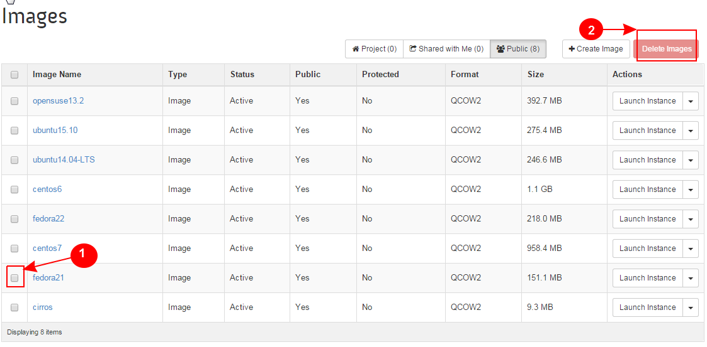

Learn OpenStack in 4 Hours
___________________________

DAY-3: More Funny Things Ahead .................! 
---------------------------------------------------------------------------------------------

In the earlier session, you worked with disk volumes and snapshots. I hoped you gained some useful information from that session.

Today we will take you to another advanced level of OpenStack operation. This session will focus on :

	1.	Working with Images

	2.	Creating Network Shared Folders

	3.	Tightening Your Security

	4.	Working With Containers

1.	Working with Images
-----------------------------------------

2.	Creating Network Shared Folders
---------------------------------------------------------

3.	Tightening Your Security
---------------------------------------------

4.	Working With Containers
----------------------------------------------

|image1|

.. |image1| image:: media/d3_image1.png
.. |image2| image:: media/d3_image2.png
.. |image3| image:: media/d3_image3.png

.. |image5| image:: media/d3_image5.png
.. |image6| image:: media/d3_image6.png
.. |image7| image:: media/d3_image7.png
.. |image8| image:: media/d3_image8.png
.. |image9| image:: media/d3_image9.png
.. |image10| image:: media/d3_image10.png
.. |image11| image:: media/d3_image11.png
.. |image12| image:: media/d3_image12.png
.. |image13| image:: media/d3_image13.png
.. |image14| image:: media/d3_image14.png
