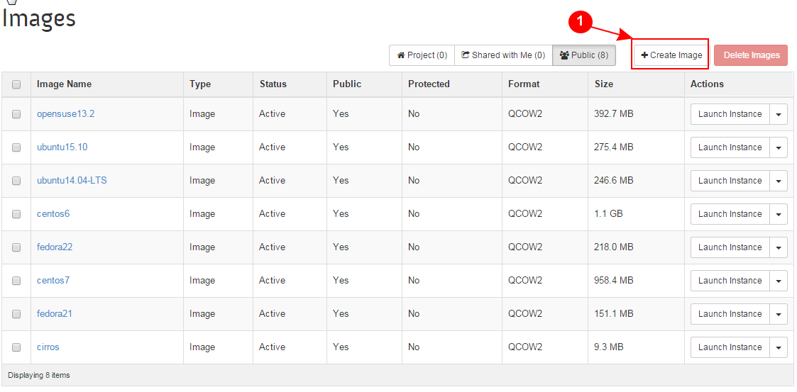
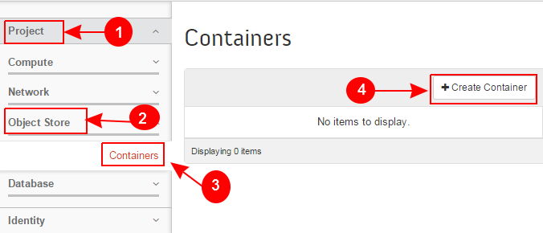

Learn OpenStack in 4 Hours
___________________________

DAY-3: More Funny Things Ahead .................! 
---------------------------------------------------------------------------------------------

In the earlier session, you worked with disk volumes and snapshots. I hoped you gained some useful information from that session.

Today we will take you to another advanced level of OpenStack operation. This session will focus on :

	1.	Working with Images

	2.	Working With Containers

	3.	Tightening Your Security

	4.	Working With Databases

	

1.	Working with Images
-----------------------------------------

In the context of OpenStack, an image or otherwise a virtual machine image is nothing but a virtual disk file containing a bootable operating system. 
OpenStack uses an image as a source to create a new virtual machine instance. As a cloud adminstrator or a user you may need to upload and maintain VM images for your cloud.
Both OpenStack dashboard as well as command line tools can be used to manage images for the cloud.

Please note that, besides command line tools like 'glance' and 'nova; you can also use the necessary APIs to maintain images.

Never confuse when you hear people saying , images or virtual machine images or virtual appliances. 
They all simply mean a virtual machine image. For simplification we will use the term 'image' to refer to virtual machine image or a virtual appliance.

In fact, without an image, the Openstack cloud is not very purposeful. So images have vital importance!

Before actually using the methods to maintain images, you must know the types and formats of images used in virtualized environments.

Images come in various formats because of the variety of hypervisors available today. Below are a few major image formats:

Raw
===

As the name indicates, this is the most simplest form of an image. KVM and Xen hypervisors love it ( and ofcourse they support it!) 
It is infact a block device file just like one created using the 'dd' command. 

We do not ask you to always use dd comand to create a raw disk image as we will discuss laters on how to create a raw image. 

qcow2
=====

QCOW2 stands for QEMU copy-on-write version 2. KVM hypervisor uses this format very commonly. There are some enhanced features provided by qcow2 over raw format which are:

	a.	It uses sparse representation which results into a smaller image size.

	b.	It supports creating disk snapshots

	c.	Due to being smaller in size, it takes less time to upload.

	d. 	OpenStack will automatically convert a raw image into qcow2 as it supports snapshots. (which is not the case with raw images)
	

AMI/AKI/ARI
========

It was the first format that was supported by Amazon Elastic Compute Cloud (Amazon EC2). The three files are:

	a.	AMI (Amazon Machine Image) is the image in raw format.
	
	b.	AKI (Amazon Kernel Image) it is the kernel ( vmlinuz) file which is laoded by the linux kernel for booting.
	
	c.	ARI (Amazon Ramdisk Image) is the ramdisk (initrd) file optionally mounted at boot time. 

UEC tarball
========

Ubuntu Enterprise Cloud (UEC)  is the tar file which contains an AMI/AKI/ARI bundle, packaged and gzipped into a single tar file.

UEC was initially build using Ubuntu and Eucalyptus cloud framework which was later on replaced with OpenStack.

VMDK
=====

Virtual Machine Disk (VMDK) format is used by VMWare's ESXi hypervisor.

VDI
====

Virtual Disk Image is a format used by VirtualBox. OpenStack Compute hypervisors do not support it straight forward. You need to convert it to qcow2 or raw to be able to use it with OpenStack.

VHD
====

Virtual Hard Disk (VHD) format is used by Microsoft Hyper-V

VHDX
====

VHDX is an upgraded version of VHD that can support larger disk size and also provides features to guard against data corruption during power failures.

OVF
===

Distributed Management Task Force (DMTF) devised the Open Virtualization Format (OVF).  OpenStack Compute does not directly support OVF packages. You will need to  extract the image file(s) from an OVF package to be able to use it with OpenStack.

ISO
===

It is the image file format most commonly used for CDs and DVDs. But since an ISO contains a bootable filesystem along with an operating system, it can be used as a virtual machine image.

1.1	Upload An Image
-------------------------------------

Now let's get back to some practical work and upload an image to our OpenStack cloud.

Follow this procedure to upload an image to a project:

Log in to the dashboard.

From the CURRENT PROJECT on the Project tab, select the appropriate project.

On the Project tab, open the Compute tab and click Images category.

A page shown in below sceenshot will be displayed:

|image1|

Click Create Image.

The Create An Image dialog box appears.

Enter the following values:

	a.	Name	Enter a name for the image.

	b.	Description	Enter a brief description of the image.

	c.	Image Source	Choose the image source from the dropdown list. Your choices are Image Location and Image File.
	
	d.	Image File or Image Location	Based on your selection for Image Source, you either enter the location URL of the image in the Image Location field, or browse for the image file on your file system and add it.
	
	e.	Format	Select the image format (for example, QCOW2) for the image.

Below screenshot depicts the steps:

|image2|

	f.	Architecture	Specify the architecture. For example, i386 for a 32-bit architecture or x86_64 for a 64-bit architecture.
	
	g.	Minimum Disk (GB) and Minimum RAM (MB)	Leave these fields empty.
	
	h.	Copy Data	Specify this option to copy image data to the Image service.
	
	i.	Public	Select this check box to make the image public to all users with access to the current project.
	
	j.	Protected	Select this check box to ensure that only users with permissions can delete the image.

Click Create Image.

The steps are also depicted in the screenshot  below:

|image3|

The image is queued to be uploaded. It might take some time before the status changes from Queued to Active

1.2	Delete an Image
------------------------------------

Deletion of images is permanent and cannot be reversed. Only users with the appropriate permissions can delete images.

Log in to the dashboard.
From the CURRENT PROJECT on the Project tab, select the appropriate project.
On the Project tab, open the Compute tab and click Images category.
Select the images that you want to delete.
Click Delete Images.

The steps are shown in the below screenshot as well

|image4|

In the Confirm Delete Images dialog box, click Delete Images to confirm the deletion.

2.	Working With Containers
---------------------------------------------------------

In OpenStack Object Storage, containers provide storage for objects in a manner similar to a Windows folder or Linux file directory, though they cannot be nested. 
An object in OpenStack consists of the file to be stored in the container and any accompanying metadata.

Create a container

Log in to the dashboard.
From the CURRENT PROJECT on the Project tab, select the appropriate project.
On the Project tab, open the Object Store tab and click Containers category.
Click Create Container.
In the Create Container dialog box, enter a name for the container, and then click Create Container.
You have successfully created a container.

Upload an object

Log in to the dashboard.

From the CURRENT PROJECT on the Project tab, select the appropriate project.

On the Project tab, open the Object Store tab and click Containers category.

Select the container in which you want to store your object.

Click Upload Object.

The Upload Object To Container: <name> dialog box appears. ``<name>`` is the name of the container to which you are uploading the object.

Enter a name for the object.

Browse to and select the file that you want to upload.

Click Upload Object.

You have successfully uploaded an object to the container

Manage an object

To edit an object

Log in to the dashboard.

From the CURRENT PROJECT on the Project tab, select the appropriate project.

On the Project tab, open the Object Store tab and click Containers category.

Select the container in which you want to store your object.

Click More and choose Edit from the dropdown list.

The Edit Object dialog box is displayed.

Browse to and select the file that you want to upload.

Click Update Object.

To copy an object from one container to another

Log in to the dashboard.
From the CURRENT PROJECT on the Project tab, select the appropriate project.
On the Project tab, open the Object Store tab and click Containers category.
Select the container in which you want to store your object.
Click More and choose Copy from the dropdown list.
In the Copy Object launch dialog box, enter the following values:
Destination Container: Choose the destination container from the list.
Path: Specify a path in which the new copy should be stored inside of the selected container.
Destination object name: Enter a name for the object in the new container.
Click Copy Object.

3.	Tightening Your Security
---------------------------------------------

Before you launch an instance, you should add security group rules to enable users to ping and use SSH to connect to the instance. Security groups are sets of IP filter rules that define networking access and are applied to all instances within a project. To do so, you either add rules to the default security group Add a rule to the default security group or add a new security group with rules.

Key pairs are SSH credentials that are injected into an instance when it is launched. To use key pair injection, the image that the instance is based on must contain the cloud-init package. Each project should have at least one key pair. For more information, see the section Add a key pair.

If you have generated a key pair with an external tool, you can import it into OpenStack. The key pair can be used for multiple instances that belong to a project. For more information, see the section Import a key pair.

When an instance is created in OpenStack, it is automatically assigned a fixed IP address in the network to which the instance is assigned. This IP address is permanently associated with the instance until the instance is terminated. However, in addition to the fixed IP address, a floating IP address can also be attached to an instance. Unlike fixed IP addresses, floating IP addresses are able to have their associations modified at any time, regardless of the state of the instances involved.

Add a rule to the default security group

This procedure enables SSH and ICMP (ping) access to instances. The rules apply to all instances within a given project, and should be set for every project unless there is a reason to prohibit SSH or ICMP access to the instances.

This procedure can be adjusted as necessary to add additional security group rules to a project, if your cloud requires them.

Note
When adding a rule, you must specify the protocol used with the destination port or source port.

Log in to the dashboard.

From the CURRENT PROJECT on the Project tab, select the appropriate project.

On the Project tab, open the Compute tab and click Access & Security category. The Security Groups tab shows the security groups that are available for this project.

Select the default security group and click Manage Rules.

To allow SSH access, click Add Rule.

In the Add Rule dialog box, enter the following values:

Rule: SSH
Remote: CIDR

Note
To accept requests from a particular range of IP addresses, specify the IP address block in the CIDR box.

Click Add.

Instances will now have SSH port 22 open for requests from any IP address.

To add an ICMP rule, click Add Rule.

In the Add Rule dialog box, enter the following values:

Rule: All ICMP
Remote: Ingress
Click Add.

Instances will now accept all incoming ICMP packets.

Add a key pair¶

Create at least one key pair for each project.

Log in to the dashboard.
From the CURRENT PROJECT on the Project tab, select the appropriate project.
On the Project tab, open the Compute tab and click Access & Security category.
Click the Key Pairs tab, which shows the key pairs that are available for this project.
Click Create Key Pair.
In the Create Key Pair dialog box, enter a name for your key pair, and click Create Key Pair.
Respond to the prompt to download the key pair.

Import a key pair

Log in to the dashboard.

From the CURRENT PROJECT on the Project tab, select the appropriate project.

On the Project tab, open the Compute tab and click Access & Security category.

Click the Key Pairs tab, which shows the key pairs that are available for this project.

Click Import Key Pair.

In the Import Key Pair dialog box, enter the name of your key pair, copy the public key into the Public Key box, and then click Import Key Pair.

Save the *.pem file locally.

To change its permissions so that only you can read and write to the file, run the following command:

$ chmod 0600 yourPrivateKey.pem
 Note
If you are using the Dashboard from a Windows computer, use PuTTYgen to load the *.pem file and convert and save it as *.ppk. For more information see the WinSCP web page for PuTTYgen.

To make the key pair known to SSH, run the ssh-add command.

$ ssh-add yourPrivateKey.pem
The Compute database registers the public key of the key pair.

The Dashboard lists the key pair on the Access & Security tab.

4.	Working With Databases
------------------------------------------------

.. |image2| image:: media/d3_image2.png
.. |image3| image:: media/d3_image3.png
.. |image4| image:: media/d3_image4.png

.. |image6| image:: media/d3_image6.png
.. |image7| image:: media/d3_image7.png
.. |image8| image:: media/d3_image8.png
.. |image9| image:: media/d3_image9.png
.. |image10| image:: media/d3_image10.png
.. |image11| image:: media/d3_image11.png
.. |image12| image:: media/d3_image12.png
.. |image13| image:: media/d3_image13.png
.. |image14| image:: media/d3_image14.png
