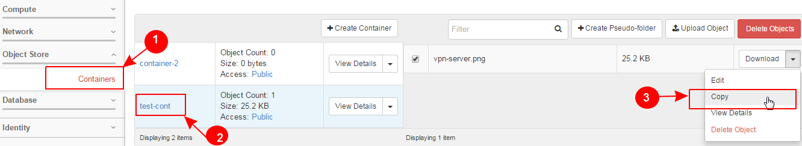

Learn OpenStack in 4 Hours
___________________________

DAY-3: More Funny Things Ahead .................! 
---------------------------------------------------------------------------------------------

In your previous interaction with OpenStack, you learned how to create a new virtual machine instance and associate it with a network.
We hope you enjoyed this! 

|image1|

.. |image1| image:: media/d3_image1.png
.. |image2| image:: media/d3_image2.png
.. |image3| image:: media/d3_image3.png
.. |image4| image:: media/d3_image4.png
.. |image5| image:: media/d3_image5.png

.. |image7| image:: media/d3_image7.png
.. |image8| image:: media/d3_image8.png
.. |image9| image:: media/d3_image9.png
.. |image10| image:: media/d3_image10.png
.. |image11| image:: media/d3_image11.png
.. |image12| image:: media/d3_image12.png
.. |image13| image:: media/d3_image13.png
.. |image14| image:: media/d3_image14.png
