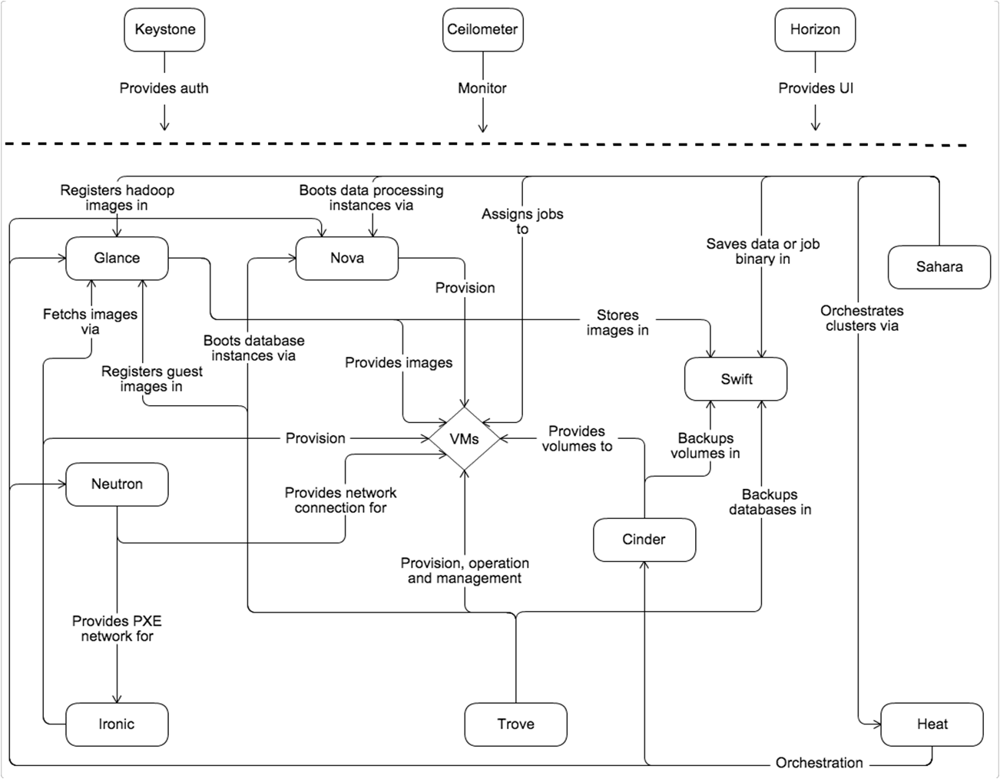
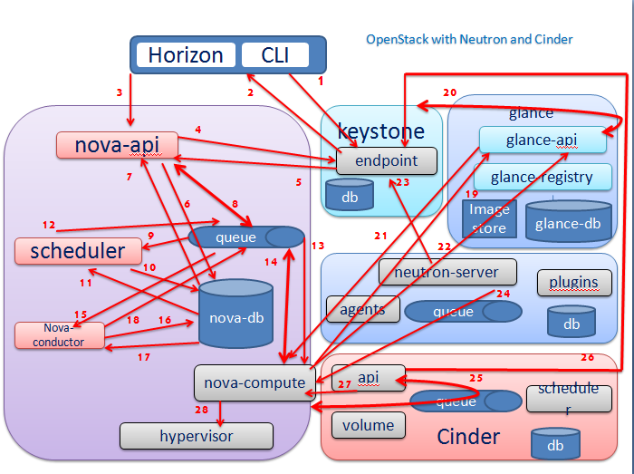
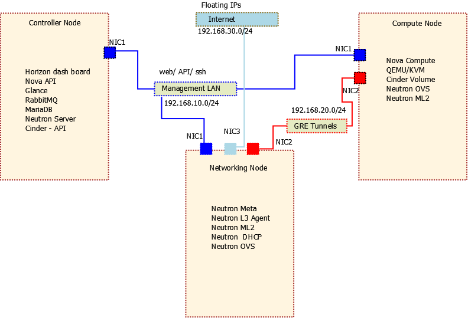
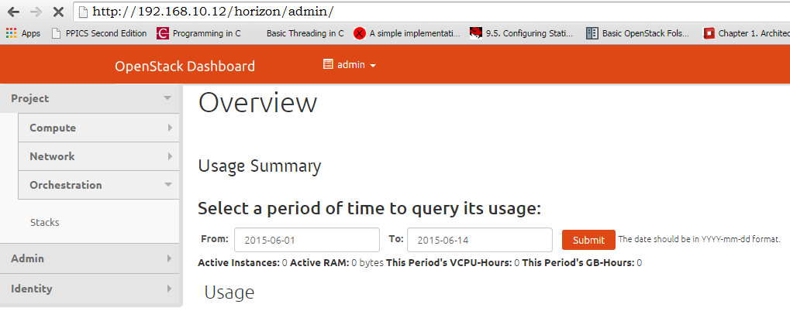

Learn OpenStack in 4 Hours
___________________________

DAY-4: What Makes OpenStack Powerful .................! 
---------------------------------------------------------------------------------------------

Many of you may have heard this famous quote:  "There is no shortcut to experience!"

So experience is something that we all need !  Let's have some more practical expereince with OpenStack.

Below are the learning ojectives of day4:
.

1. 	 Understanding OpenStack Components

2.	 OpenStack Node Types

3.	Installing OpenStack from Scratch

	
1. 	 Understanding OpenStack Components
-----------------------------------------------------------------
Generally an OpenStack cloud consists of following core services:

-	OpenStack Compute (nova)

-	OpenStack Networking (neutron)

-	OpenStack Image service (glance)

-	OpenStack Identity (keystone)

-	OpenStack dashboard (horizon)

-	Telemetry (ceilometer)

-	Orchestration Service (Heat)
	
-	OpenStack Object Storage (swift)
	
-	OpenStack Block Storage (cinder). 
	
-	Database as a Service (Trove)

-	Big Data Applications\Hadoop (Sahara)
	
-	OpenStack Messaging Service

Below diagram shows several Openstack components integrated with each other:

|image1|

Let's explain each term very briefly:

OpenStack Compute (nova):	It provides the hypervisor service to the cloud environment. Compute (“Nova”) retrieves virtual disks images , attach flavor and associated metadata and transforms end user API requests into running instances.
OpenStack supports hypervisors including:

-		KVM - Kernel-based Virtual Machine. In this case the virtual disk format is inherited from QEMU since it uses a modified QEMU program to launch the virtual machine. The supported disk formats include raw images, the qcow2, and VMware formats.

-		LXC - Linux Containers (through libvirt), are used to run Linux-based virtual machines.

-		QEMU - Quick EMUlator, mostly used by developers.

-		UML - User Mode Linux, mostly used by developers.

-		VMware - VMware-based Linux and Windows images  are used by vSphere through a connection with a vCenter server or directly with an ESXi host.

-		Xen - XenServer, Xen Cloud Platform (XCP), use to run Linux or Windows virtual machines. You must install the nova-compute service in a para-virtualized VM.

-		Hyper-V - Used to create Windows, Linux, and FreeBSD virtual machines. It runs nova-compute natively on the Windows virtualization platform.

-		Bare Metal - It is not a traditional hypervisor, rather its a driver that provisions physical hardware through pluggable sub-drivers 
		(e.g, PXE for image deployment, and IPMI for power management).

OpenStack Networking (neutron) : 	provides networking service to other OpenStack components. This includes, VLANs , ip address information and routing etc.
It provides virtual networking for Compute which allows users to create their own networks and then link them to the instances.

OpenStack Image service (glance) :        provides services including discovering, registering, and retrieving virtual machine images. 
It provides a RESTful API for querying of VM image metadata as well as retrieval of the actual image.

OpenStack Identity (keystone) :	provides authentication and authorization for all OpenStack services.

OpenStack dashboard (horizon) :	provides the interface for all the OpenStack services.

Telemetry (ceilometer) :		provides metering and resource metering service to the cloud environment.

Orchestration Service (Heat) :		provides features like automatic out scaling of cloud resources.
	
OpenStack Object Storage (swift) :	provides an object store for keeping data as well as associated metadata.
	
OpenStack Block Storage (cinder) :	provides persistent storage volumes for Compute instances.
	
Database as a Service (Trove) :	provides database as a service.

Message Queue(“RabbitMQ”)  : 	handles the internal communication within Openstack components such as Nova , neutron and Cinder.

OpenStack CLI :			command Line Interpreter for submitting commands to OpenStack Compute.

Big Data Applications\Hadoop (Sahara)	provides deployment of huge data intesive applications like hadoop.

Provisioning a new instance involves the interaction between multiple components inside OpenStack :

1.1	Request Flow for Instance Provisioning
======================================

The request flow for provisioning an Instance goes like this:

1.	Dashboard or CLI gets the user credential and does the REST call to Keystone for authentication.

2.	Keystone authenticate the credentials and generate & send back auth-token which will be used for sending request to other Components through REST-call.

3.	Dashboard or CLI convert the new instance request specified in  ‘launch instance’ or ‘nova-boot’ form to REST API request and send it to nova-api.

4.	nova-api receive the request and sends the request for validation auth-token and access permission to keystone.

5.	Keystone validates the token and sends updated auth headers with roles and permissions.

6.	nova-api interacts with nova-database.

7.	Creates initial db entry for new instance.
 
8.	nova-api sends the rpc.call request to nova-scheduler excepting to get  updated instance entry with host ID specified.

9.	nova-scheduler picks the request from the queue.

10.	nova-scheduler interacts with nova-database to find an appropriate host via filtering and weighing.

11.	Returns the updated instance entry with appropriate host ID after filtering and weighing.

12.	nova-scheduler sends the rpc.cast request to nova-compute for ‘launching instance’ on appropriate host .

13.	nova-compute picks the request from the queue.

14.	nova-compute send the rpc.call request to nova-conductor to fetch the instance information such as host ID and flavor( Ram , CPU ,Disk).

15.	nova-conductor picks the request from the queue.

16.	nova-conductor interacts with nova-database.

17.	Return the instance information.

18.	nova-compute picks the instance information from the queue.

19.	nova-compute does the REST call by passing auth-token to glance-api  to get the Image URI by Image ID from glance and upload image from image storage.

20.	glance-api validates the auth-token with keystone. 

21.	nova-compute get the image metadata.

22.	nova-compute does the REST-call by passing auth-token to Network API to allocate and configure the network such that instance gets the IP address. 

23.	quantum-server validates the auth-token with keystone.

24.	nova-compute get the network info.

25.	nova-compute does the REST call by passing auth-token to Volume API to attach volumes to instance.

26.	cinder-api validates the auth-token with keystone.

27	nova-compute gets the block storage info.

28.	nova-compute generates data for hypervisor driver and executes request on Hypervisor( via libvirt or api).

The same is depicted in the image below:

|image2|

2.	 OpenStack Node Types
----------------------------------------------

Controller
=======

Controller nodes are responsible for running the management software services needed for the OpenStack environment to function. These nodes:

Provide the front door that people access as well as the API services that all other components in the environment talk to.

Run a number of services in a highly available fashion, utilizing Pacemaker and HAProxy to provide a virtual IP and load-balancing functions so all controller nodes are being used.

Supply highly available "infrastructure" services, such as MySQL and Qpid, that underpin all the services.

Provide what is known as "persistent storage" through services run on the host as well. This persistent storage is backed onto the storage nodes for reliability.

Compute
=======

Compute nodes run the virtual machine instances in OpenStack. They:

Run the bare minimum of services needed to facilitate these instances.

Use local storage on the node for the virtual machines so that no VM migration or instance recovery at node failure is possible.

Network
======

Network nodes are responsible for doing all the virtual networking needed for people to create public or private networks and uplink their virtual machines into external networks. Network nodes:

Form the only ingress and egress point for instances running on top of OpenStack.

Run all of the environment's networking services, with the exception of the networking API service (which runs on the controller node).

Utility
====

Utility nodes are used by internal administration staff only to provide a number of basic system administration functions needed to get the environment up and running and to maintain the hardware, OS, and software on which it runs.

These nodes run services such as provisioning, configuration management, monitoring, or GlusterFS management software. They are not required to scale, although these machines are usually backed up.

Storage
======

Storage nodes store all the data required for the environment, including disk images in the Image service library, and the persistent storage volumes created by the Block Storage service. Storage nodes use GlusterFS technology to keep the data highly available and scalable.

3.	Building OpenStack from Scratch
-----------------------------------------------------------

We have made available for you a few helping bash scripts for deploying an OpenStack cloud from start. 

Below is the cloud architecture that we want to build:

|image3|

Below are the pre-requisities:

-		Three physical / virtual machines with CentOS 6 installed. (one node with single NIC, one node with dual NICs and one node with three NICs)

-		Hardware virtualization enabled in the host machine (where compute node will be installed)

-		Three subnets (management, private and public)

So let's say we have got three servers with CentOS 6 installed as one for the controller node, one for the network node and one for the compute node. 
Let's say we have hardware virtualization enabled in the BIOS settings of the compute node. Also we take below three subnets:

-		Management network 	192.168.10.0/24	(will be used for ssh from management server to compute and network serves. also horizon dashboard will be accessed on this network.

-		Tunnel Network		192.168.20.0/24	(will be used for software defined netwroking services)

-		Public Network		192.168.30.0/24	(will be used to assign floating IPs to the VMs so that they can be accessed remotely over Internet)

The management node will require only one NIC to connect to the management network.

The network node will require total three NICs, one for the public network traffic, one for tunnel traffic and one for management traffic.

The tunnel network will carry software-defined networks between the network node and the compute nodes.

The compute node will require total two NICs, one for the tunnel network, and one for management network.
Also it will require a 2nd hard disk for cinder-volumes ( that will provide virtual disks to the instances).

So let's get started by assigning IP addresses to all three hosts on the management network first. 
Wait, don't kill yourself by manually editing the configuration files. We have made a small script to assist you in this. 

NIC1
------
We will assgin these IP addresses on the NIC1 on three nodes:

-	cloud-compute	192.168.10.10

-	cloud-network	192.168.10.11

-	cloud-controller	192.168.10.12

NIC2
------
Since NIC2 is required on compute and network only so we will assign them below addresses:
	
-	cloud-compute	192.168.20.10

-	cloud-network	192.168.20.20

NIC3
------
NIC3 is installed on network node only however it does not need to be assigned a static IP address.

Installing the Controller Node
--------------------------------------

We will start with the controller node first. There are three files present under the folder named controller here:

-	controller.conf 		(This the configuration file containing IP address information and passwords information)
	
-	controller-setup-ip.sh	( This script configures the IP address mentioned in the configuration file)
	
-	controller-install.sh		(This script downloads the nessary packages and installs openstack controller)

Follow below steps to install the controller node:

1.	Download folder named controller to the controller node ( make sure it contains all three files mentioned above).

2.	Run the script 'controller-setup-ip.sh' to configure the IP management IP address

`` # bash controller-setup-ip.sh``

3.	Reboot the server so that configuration changes may take affect

`  # reboot`

4.	After the system is rebooted and is back to normal, run the script 'controller-install.sh'

``  # bash controller-install.sh``
This will take a while as it will download all necessary packages for controller node and install them.

5.	Finally reboot the server once more to get the controller node up and running.

`` # reboot``

Installing the Network Node
--------------------------------------
The folder named 'network' contains four files as :

-	neutron.conf 		(This the configuration file containing IP address information and passwords information)
	
-	neutron-setup-ip.sh		( This script configures the IP address mentioned in the configuration file)
	
-	neutron-install.sh		(This script downloads the nessary packages and installs openstack 

-	neutron-create-networks.sh	( Creates neutron networks )

Follow below steps to install the network node:

1. Checkout the neutron.conf file .Make sure that it contains the correct IP address.

2.	Run the script 'neutron-setup-ip.sh' to configure the IP management IP address

		# bash neutron-setup-ip.sh

3.	Reboot the server so that configuration changes may take affect

		# reboot

4.	After the system is rebooted and is back to normal, run the script 'controller-install.sh'

		# bash neutron-install.sh

This will take a while as it will download all necessary packages for controller node and install them.

5.	Finally reboot the server once more to get the controller node up and running.

		# reboot 	

We will run the scripts 'neutron-create-networks.sh' after installing compute node.

Installing the Compute Node
--------------------------------------

The folder named 'compute' contains below files:

-	compute.conf 		(This the configuration file containing IP address information and passwords information)
	
-	compute-setup-ip.sh		( This script configures the IP address mentioned in the configuration file)
	
-	compute-install.sh		(This script downloads the nessary packages and installs openstack 

Follow below steps to install the network node:

1. Checkout the compute.conf file .Make sure that it contains the correct IP address.

2.	Run the script 'compute-setup-ip.sh' to configure the IP management IP address

		# bash compute-setup-ip.sh

3.	Reboot the server so that configuration changes may take affect

		# reboot

4.	After the system is rebooted and is back to normal, run the script 'compute-install.sh'

		# bash compute-install.sh

This will take a while as it will download all necessary packages for controller node and install them.

5.	Finally reboot the server once more to get the controller node up and running.

		# reboot 	

Accessing the OpenStack Dashboard
--------------------------------------------------

If everything has gone well so far then you are done. Congratualtions! You can access the the dashboard at:

http://192.168.10.12/horizon

You can rock and roll with your own private cloud!

.. |image5| image:: media/d4_image5.png
.. |image6| image:: media/d4_image6.png
.. |image7| image:: media/d4_image7.png
.. |image8| image:: media/d4_image8.png
.. |image9| image:: media/d4_image9.png
.. |image10| image:: media/d4_image10.png
.. |image11| image:: media/d4_image11.png
.. |image12| image:: media/d4_image12.png
.. |image13| image:: media/d4_image13.png
.. |image14| image:: media/d4_image14.png
