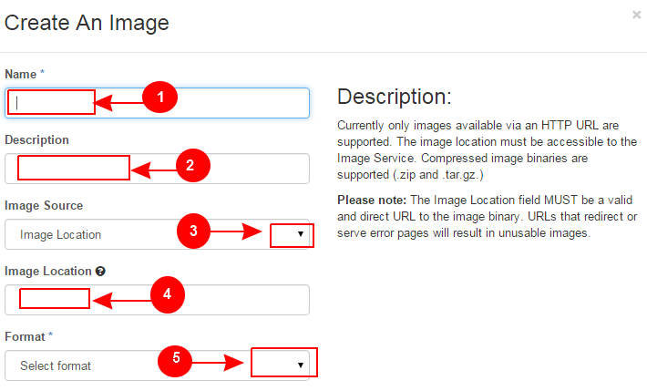
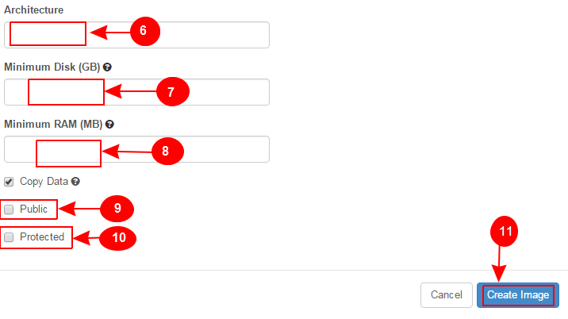
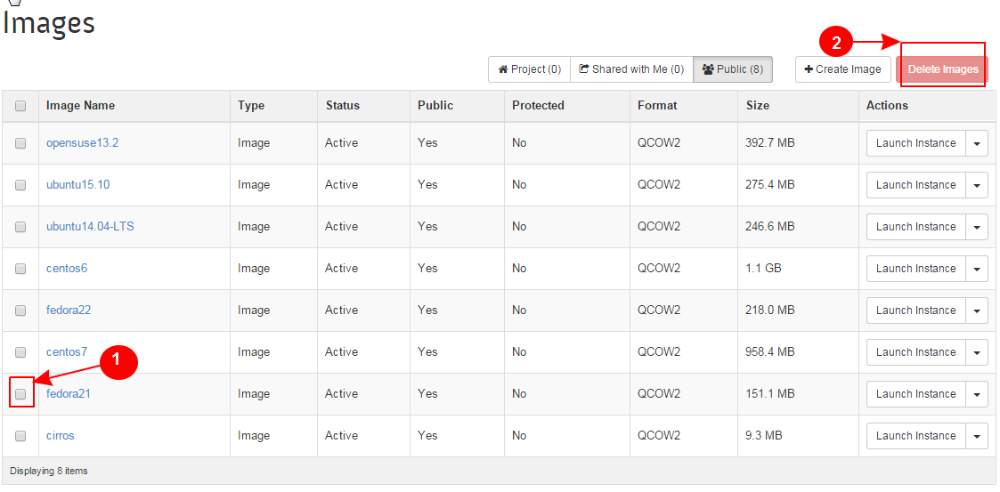
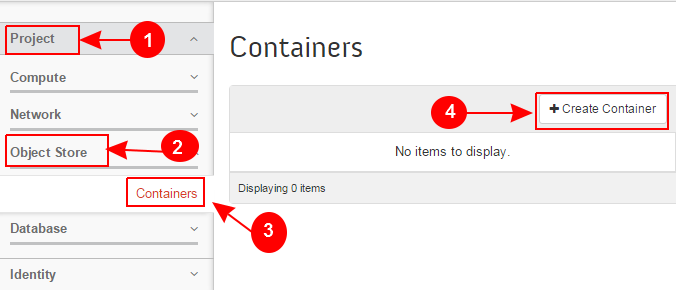
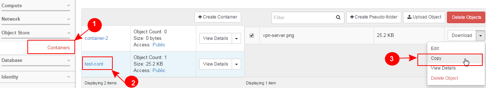

Learn OpenStack in 4 Hours
___________________________

DAY-4: Let's Be Practical with OpenStack .................! 
---------------------------------------------------------------------------------------------

Many of you may have heard this famous quote:

"There is no shortcut to experience!"

Let's have some more practical expereince with OpenStack.

Understand how the magic happens.

|image1|

.. |image1| image:: media/d3_image1.png

.. |image7| image:: media/d3_image7.png
.. |image8| image:: media/d3_image8.png
.. |image9| image:: media/d3_image9.png
.. |image10| image:: media/d3_image10.png
.. |image11| image:: media/d3_image11.png
.. |image12| image:: media/d3_image12.png
.. |image13| image:: media/d3_image13.png
.. |image14| image:: media/d3_image14.png
