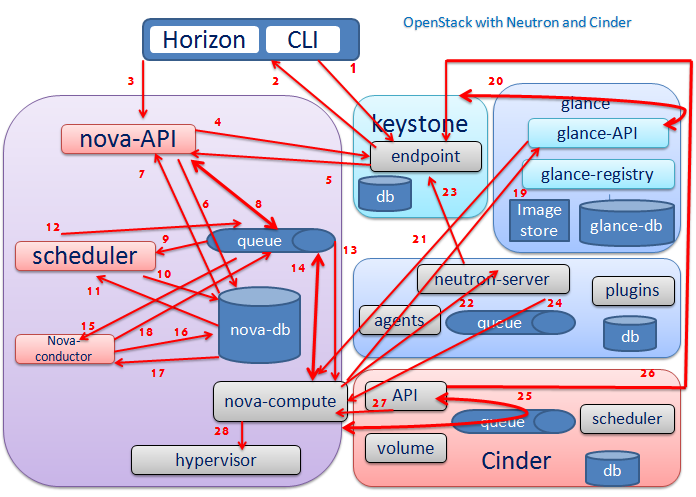

Learn OpenStack in 4 Hours
___________________________

DAY-4: Let's Be Practical with OpenStack .................! 
---------------------------------------------------------------------------------------------

Many of you may have heard this famous quote:  "There is no shortcut to experience!"

So experience is something that we all need !  Let's have some more practical expereince with OpenStack.

Below are the learning ojectives of day4:
.

1. 	 Understanding OpenStack Echosystem

2.	 OpenStack Node Types

3.	Building OpenStack from Scratch

1. 	 Understanding OpenStack Echosystem
-----------------------------------------------------------------

|image1|

Provisioning a new instance involves the interaction between multiple components inside OpenStack :

1.	CLI Command Line Interpreter for submitting commands to OpenStack Compute.

2.	Dashboard (“Horizon”) provides the interface for all the OpenStack services.

3.	Compute (“Nova”) retrieves virtual disks images(“Glance”) , attach flavor and associated metadata and transforms end user API requests into running instances.

4.	Network (“Quantum”) provides virtual networking for Compute which allows users to create their own networks and then link them to the instances.

5.	Block Storage (“Cinder”) provides persistent storage volumes for Compute instances.

6.	Image (“Glance”) can store the actual virtual disk files in the Image Store.

7.	Identity (“Keystone”) provides authentication and authorization for all OpenStack services.

8.	Message Queue(“RabbitMQ”) handles the internal communication within Openstack components such as Nova , Quantum and Cinder.

9.	The request flow for provisioning an Instance goes like this:

10.	Dashboard or CLI gets the user credential and does the REST call to Keystone for authentication.

11.	Keystone authenticate the credentials and generate & send back auth-token which will be used for sending request to other Components through REST-call.

12.	Dashboard or CLI convert the new instance request specified in  ‘launch instance’ or ‘nova-boot’ form to REST API request and send it to nova-api.

13.	nova-api receive the request and sends the request for validation auth-token and access permission to keystone.

14.	Keystone validates the token and sends updated auth headers with roles and permissions.

15.	nova-api interacts with nova-database.

16.	Creates initial db entry for new instance.
 
17.	nova-api sends the rpc.call request to nova-scheduler excepting to get  updated instance entry with host ID specified.

18.	nova-scheduler picks the request from the queue.

19.	nova-scheduler interacts with nova-database to find an appropriate host via filtering and weighing.

20.	Returns the updated instance entry with appropriate host ID after filtering and weighing.

21.	nova-scheduler sends the rpc.cast request to nova-compute for ‘launching instance’ on appropriate host .

22.	nova-compute picks the request from the queue.

23.	nova-compute send the rpc.call request to nova-conductor to fetch the instance information such as host ID and flavor( Ram , CPU ,Disk).

24.	nova-conductor picks the request from the queue.

25.	nova-conductor interacts with nova-database.

26.	Return the instance information.

27.	nova-compute picks the instance information from the queue.

28.	nova-compute does the REST call by passing auth-token to glance-api  to get the Image URI by Image ID from glance and upload image from image storage.

29	glance-api validates the auth-token with keystone. 

30.	nova-compute get the image metadata.

31.	nova-compute does the REST-call by passing auth-token to Network API to allocate and configure the network such that instance gets the IP address. 

32	quantum-server validates the auth-token with keystone.

33.	nova-compute get the network info.

34.	nova-compute does the REST call by passing auth-token to Volume API to attach volumes to instance.

35.	cinder-api validates the auth-token with keystone.

36.	nova-compute gets the block storage info.

37.	nova-compute generates data for hypervisor driver and executes request on Hypervisor( via libvirt or api).

The same is depicted in the image below:

|image2|

2.	 OpenStack Node Types
----------------------------------------------

3.	Building OpenStack from Scratch
-----------------------------------------------------------

.. |image1| image:: media/d4_image1.png

.. |image3| image:: media/d4_image3.png

.. |image5| image:: media/d4_image5.png
.. |image6| image:: media/d4_image6.png
.. |image7| image:: media/d4_image7.png
.. |image8| image:: media/d4_image8.png
.. |image9| image:: media/d4_image9.png
.. |image10| image:: media/d4_image10.png
.. |image11| image:: media/d4_image11.png
.. |image12| image:: media/d4_image12.png
.. |image13| image:: media/d4_image13.png
.. |image14| image:: media/d4_image14.png
